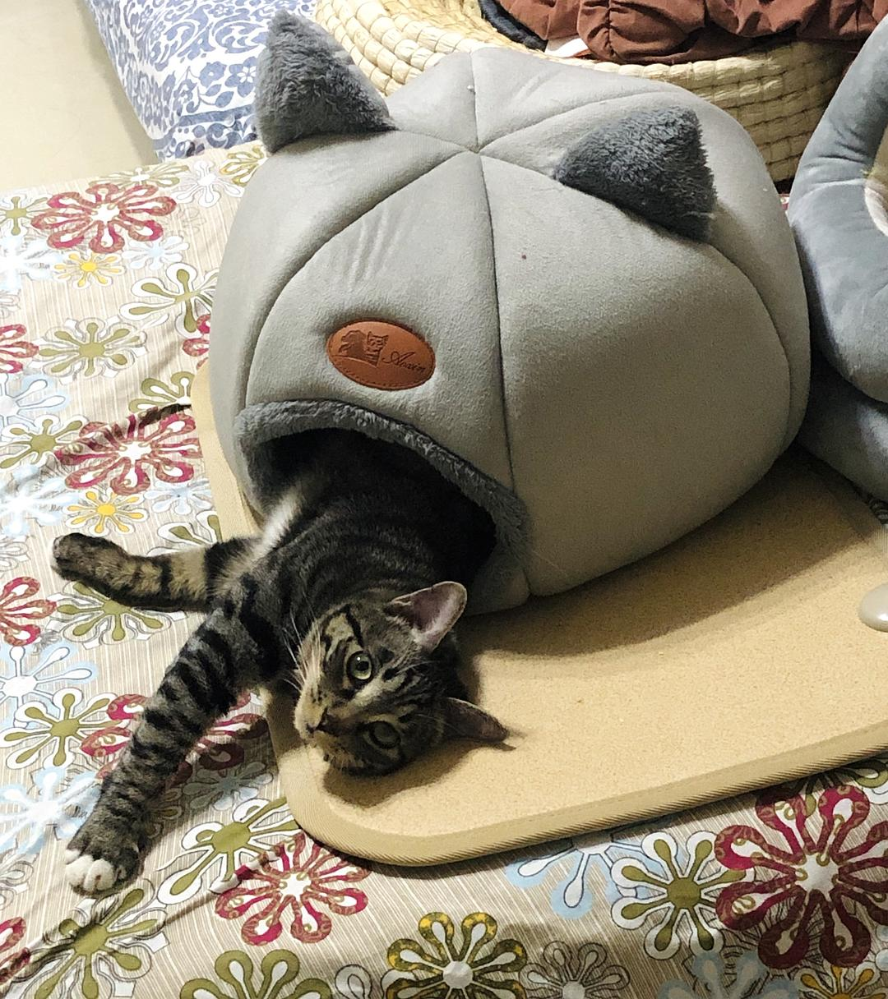
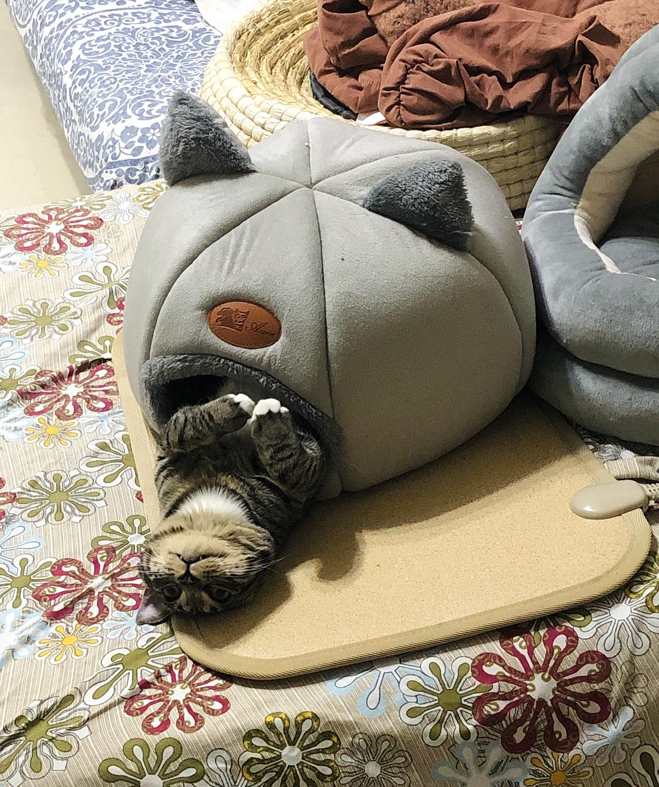
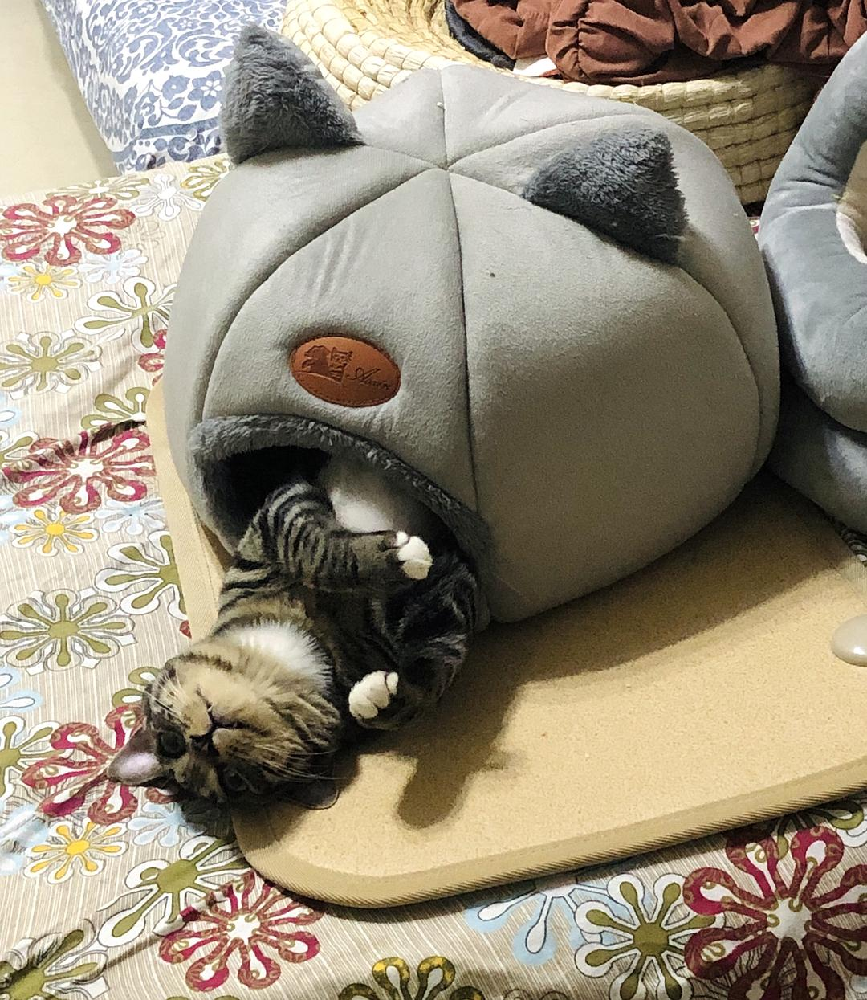

来源：[地味鸭（来自豆瓣）](https://www.douban.com/people/47513232/)的[广播](https://www.douban.com/people/47513232/status/2797034652/)

2020-02-07_23:31:51

Day16.早上醒太晚，错过了抢美菜，心痛不已。下午只好去盒马买菜，菜不多了但人可不少。见识到了武汉人民各种各样的自制野生防护服，贼有创意。买了牛腩猪肋排五花肉豆腐萝卜生菜红菜苔西红柿花菜青菜西兰花。结账的时候捡到了别人放弃不要的胡萝卜，太幸运惹！还是有很多想买的菜根本没有，想买土豆冬瓜茄子，找了半天一个也无。货架很多是空的，包装漂亮的一捆菜往往叶子又黄又蔫，只能看到什么拿什么。盒马员工自己也在吐槽菜不新鲜，又说今天已经算菜很多了，新来了很多货，比前两天好太多！听完感觉自己运气真好。
猫还没有明显发情迹象，天天没心没肺自己玩得很开心。
  

  

  

  

