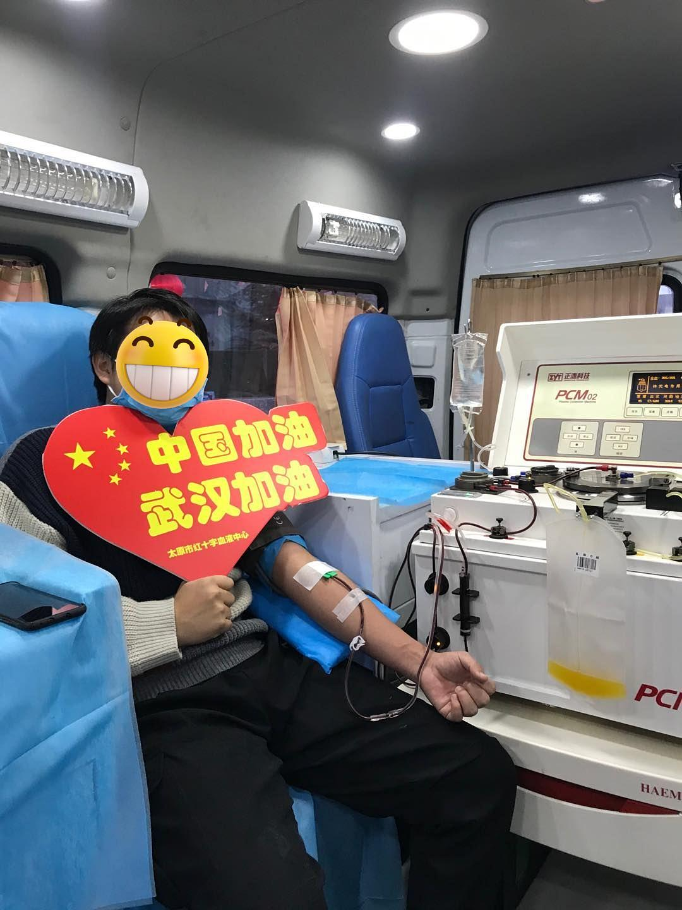
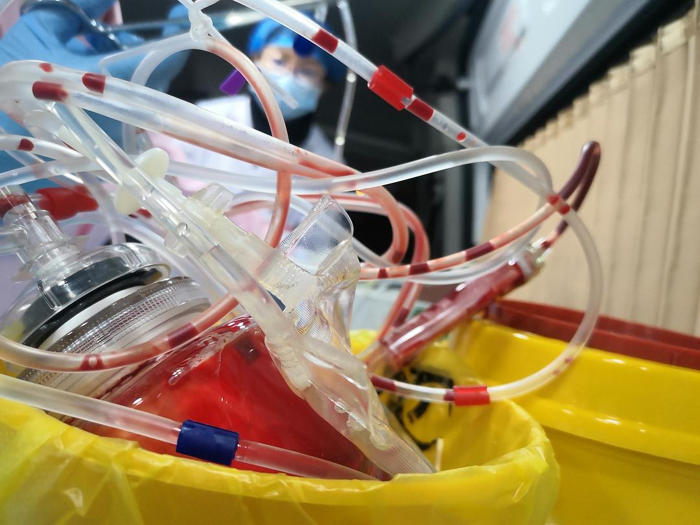
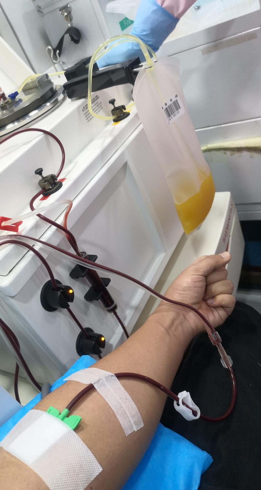

来源：[二手时间（来自豆瓣）](https://www.douban.com/people/198700809/)的[广播](https://www.douban.com/people/198700809/status/2798985361/)

2020-02-08_23:09:18

今天中午医院的护士姐姐给我发消息
希望我可以下午去献血浆，用以实验室研究抗体
因为之前在学校有两次献血经验所以也没什么惧怕的

血液中心的医务人员们很关心我，也都是和专家和站长见面

他们说我的血浆可以救好几个人，我也不奢望那些，只是希望在这个特殊的时候在自己能力范围内能身体力行的为国家和社会还有那些现在还在住院的或轻或重的肺炎患者做一些事。

献血浆的时候还是有一些不知道的人在外面录像和拍照，很害怕有媒体再来报道，不想有那么大动静，做好自己的事就好了。

没有那么伟大也没有那么光荣，只是一个普通人应该做的

武汉加油，中国加油
  

  

  

  

