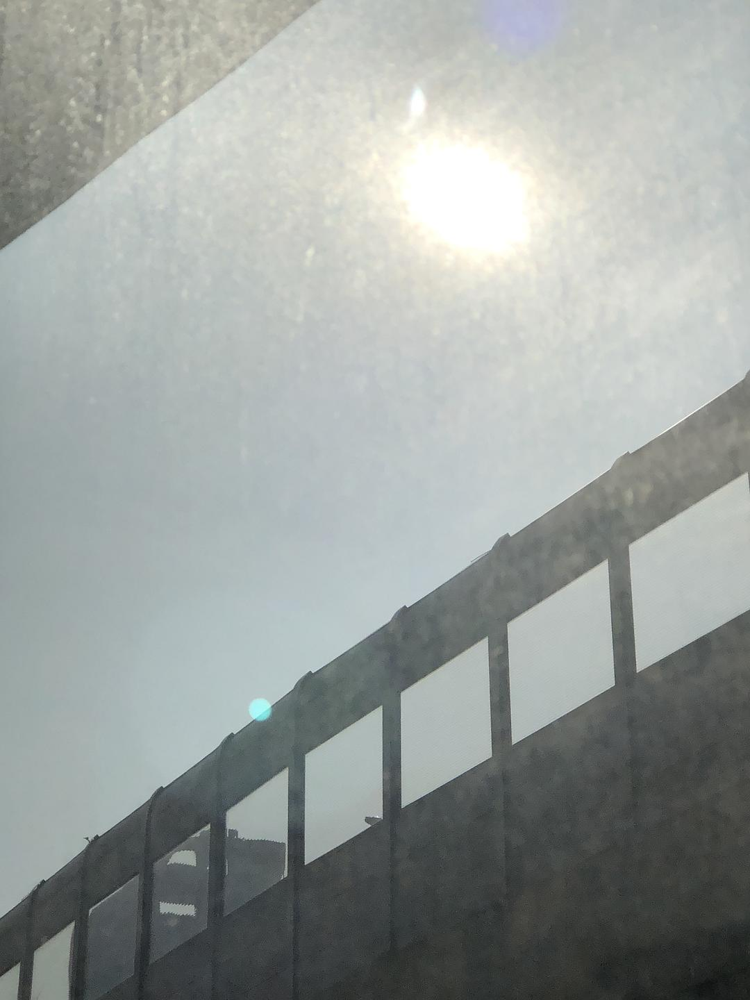

来源：[陈星宇作词（来自豆瓣）](https://www.douban.com/people/chenxingyu2009/)的[广播](https://www.douban.com/people/chenxingyu2009/status/2800037080/)

2020-02-09_14:41:22

【星星日记：20200209武汉封城第十八天】今天是阳光明媚的一天，感觉武汉好像都热乎起来了了。见到太阳，心情也畅快很多。今天武汉官方发布了返程以及回汉人员的相关安排以及管理措施公告。这个事情暂时还没有上热搜，我就好奇了，这个举措背后的态度，是允许人员批量返回武汉，真的跟月初官方公告所言，允许2月14日武汉全城开始复工了？那又一个相关的问题就是开城时间了，那也会在14日之前开城。如果不开城，何来复工？ 不担心人流交叉感染了？武汉疫情总体已经可控了？人员居家隔离可以解除了？
  

