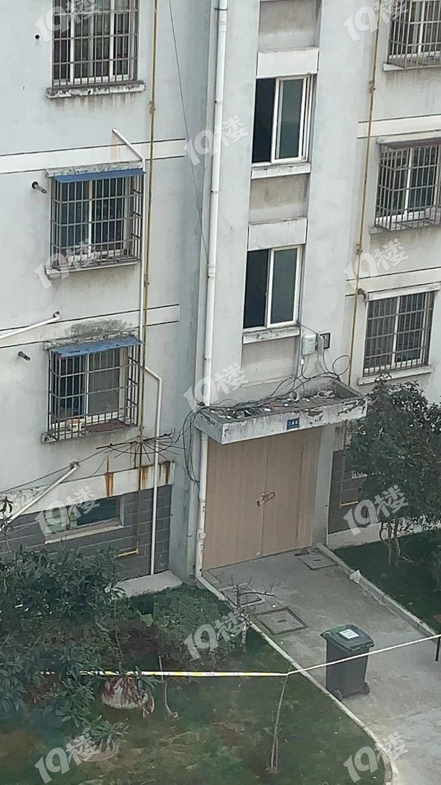

来源：[无机客（来自豆瓣）](https://www.douban.com/people/tensor/)的[广播](https://www.douban.com/people/tensor/status/2801893036/)

2020-02-10_13:12:44

杭州市是锁住居民家门，而嘉兴某个老小区是因为某栋楼里发现感染新冠肺炎者，将一个楼道装上木门，封闭反锁起来。
  

  

