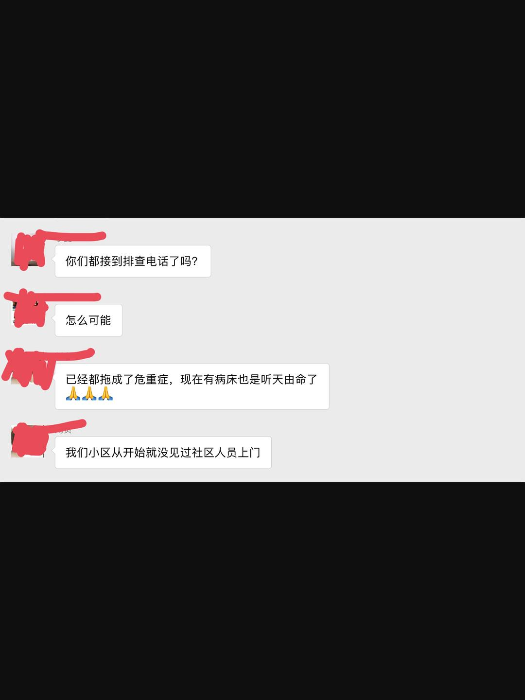

来源：[逍遥容与（来自豆瓣）](https://www.douban.com/people/2846709/)的[广播](https://www.douban.com/people/2846709/status/2803065478/)

2020-02-10_22:57:54

3天前，从新闻上得知武汉政府要上门排查所有市民，当时想，等我们小区的排查人员上门，坚决不能开门，所谓“斯有陋室，虽风可进雨可进，国王不得进矣。”这几日正自纠结如何应对上门排查，刚看新闻得知，吾市已排查99%市民，排查工作基本已近结束！顿时恍惚起来，怎么偏偏我们全家三户五房都未接到一个电话未见一个排查人员，俱在1%之列呢？然而朋友圈里转一遭，才知道原来大家都是1%——多么魔幻时代，果然又应了爱玲小姐那句话“事实比虚构有更深沉戏剧性”。。。。
  

  

  

