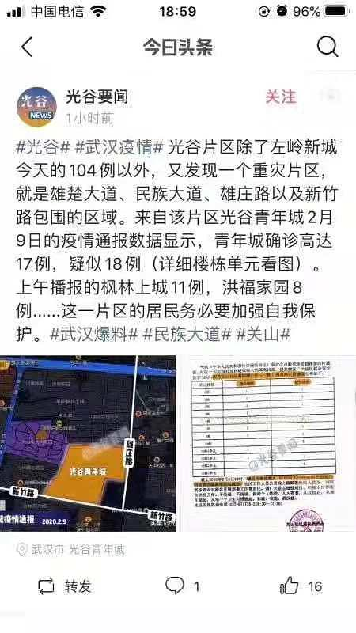

来源：[小钻风（来自豆瓣）](https://www.douban.com/people/58982367/)的[广播](https://www.douban.com/people/58982367/status/2803139178/)

2020-02-10_23:25:26

2020年武汉因新冠状病毒肺炎封城day19

人类可能正在开启又一次进入进化论的时机。。。
但却首先是因为一个蠢货。。。
不得不让人重新思考历史的偶然性。。。

今天是禁止公布新确诊病例的时间，所以社区没有新公告了，不过在轰轰烈烈的买菜群里，偶尔还是可以看到周边小区的一点情况，据说中建康城有确诊而且还未集中隔离。。。稍远一点点的地方，津发小区有确诊，光谷青年城是确诊十八例的重灾区，这些如同星星之火进入了买菜信息的汪洋大海，结果就是激起了强烈的团购囤菜欲望。
刚好微信又可以提供几种版本的在线统计表格，方便每个人填好自己想要的东西，店家直接照单配货即可。
我对微商一直没什么了解，直到这次看到一堆人拼命在购物单上填写各种物品的时候才算真正有了切身体会吧，这种线上购买的气氛甚至不比现场差。。。
提供自选购物的超市在居然之家，其实不算远，但我一直以为里面是卖建材的，因为不想进去吸甲醛，所以一次都没去过。
这家超市每天提供附近5，6个小区的配送服务，今天就本小区一共大概80多户，以平均每户在300，400之间，从早上九点开始配送到晚上九点多，总共三到四趟就有过三万多的营业额，这还是保守估计，因为有些家庭购买金额都在700，500多，相信这样的经营方式还能持续一段时间，而收入只会远超于平时，因为顾客可选范围是大幅缩小的，比如说这些配送里面是没有肉类的。
看到别的老板生意兴隆，附近门口的生鲜超市老板也心动起来，轰轰烈烈的建群发红包，很快就加到500人了。同样也要搞这种线上自选+无接触自提的模式了。
相比之下什么长江日报搞的87一份的蔬菜包还要几十家起送则远不及上述方式灵活。更不要提什么300多的冻肉包，毕竟有双开门大冰箱的家庭不是主流，而且放个几kg冻肉在家里吃也不合中国人的习惯。
病疫阴影尚在写这些什么意思呢，其实中国人的国民性里就是有喜欢自寻乐趣，急于消解悲剧的一面，方舱都跳起了集体舞，在家闭门不出的人化焦虑为食量有什么不可以的呢？
附两张图，图一是附近小区确诊情况，图二是部分家庭灾期的消费表，注意有些东西是没有的，比如猪肉或者其他肉类。
  

  

