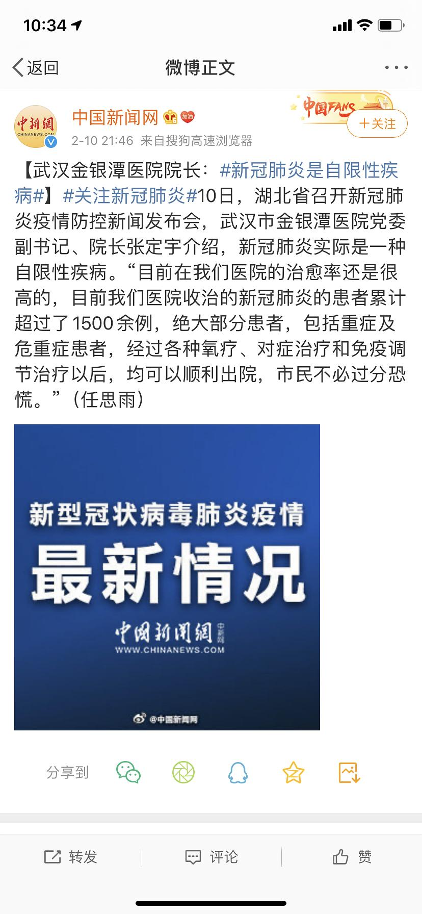

来源：[Lawyer_Tam（来自豆瓣）](https://www.douban.com/people/50118435/)的[广播](https://www.douban.com/people/50118435/status/2803205183/)

2020-02-10_23:49:31

从明天起，把新冠肺炎当流感对待，
做菜，读书，喝酒。
从明天起，关心粮食和蔬菜价格
我有一辆车子，面朝大海，春暖花开。
从明天起，和每一个亲人通电话，
告诉他们，我很好。
  

