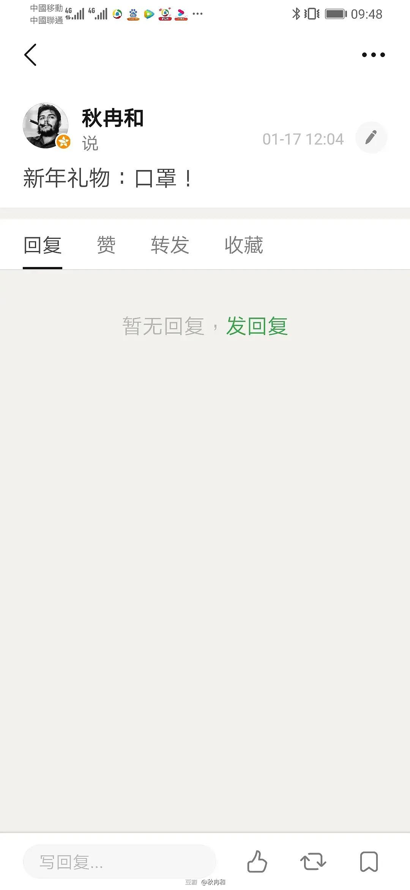

来源：[秋冉和（来自豆瓣）](https://www.douban.com/people/75438048/)的[广播](https://www.douban.com/people/75438048/status/2804003701/)

2020-02-11_12:56:05

2020年1月3日，我在家族群里提醒家人买n95口罩。只有我爸，回应“知道了”。后来打电话给我妈。我妈骂我“神经病”“杞人忧天”。

1月17日，我在豆瓣提醒豆友买口罩，被数人取关。

1月20日，官宣，紧接着钟南山先生说：人传人。口罩很快脱销。

今天！我让我妈囤粮。我妈骂我“神经病”“杞人忧天”！

历史总是轮回，他们总是善忘！我还要怎么提醒？？？！！！
  

  

