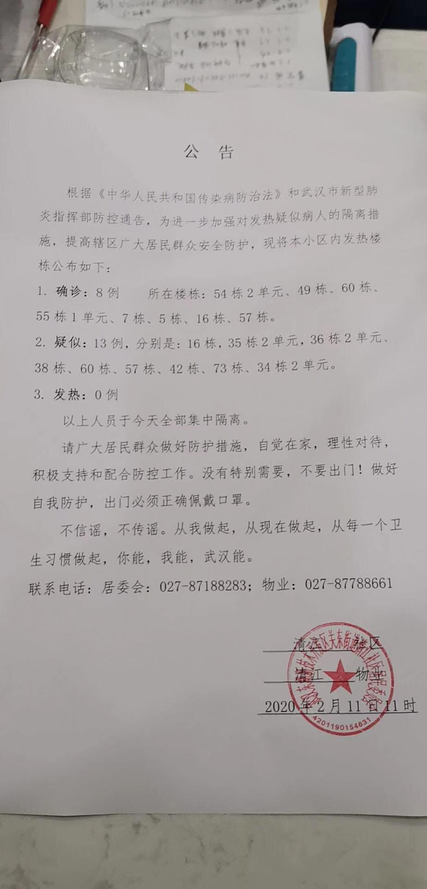
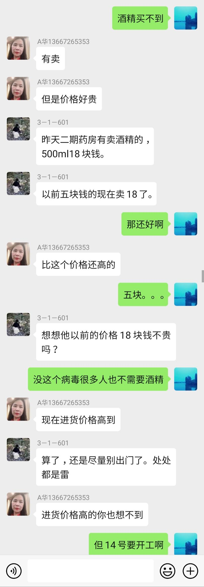

来源：[小钻风（来自豆瓣）](https://www.douban.com/people/58982367/)的[广播](https://www.douban.com/people/58982367/status/2805045262/)

2020-02-11_22:19:38

2020年武汉因新冠状病毒肺炎封城day20
在昨天暂停一天公告之后，社区终于发了新的公告，确诊数字变成了8位，疑似数字则是13位，发热数字为0，无论是确诊和疑似数字的增加还是发热数字为0应该均不符合领导的需求，所谓该减少的没有减少，该增加的没有增加。。。怎么体现出社区的工作价值？

不过今天多了一份严格封小区的公告，终于有了一个叫做出入证的东西，再配合我数着剩下的奶油巧克力球的样子，终于有了点一九三十年代的实感了？(并没有。)

虽然即使没有那通行证也打算宅家里，但有那张纸感觉还是不一样吧，因为限制出行，昨天忙于配货的尚品超市今天也停止送货了，很多大客户应该是不愿意去超市了，还被是离得近的米乐抢去了生意，同样可以到店自取，也有大家最想买的肉类。。。米乐今天的170单应该也有过两万的营业额，当然这种配送速度远远赶不上平时沃尔玛淘达鲜之类的效率，无论是前端还是后端都比较混乱，只能说钱也不是那么好赚的，尤其是像现在这种每天不一样的局势。

另外算是问了一下邻居关于新冠是几时被知道这件事上，得到了两个比较意外的消息，一个是原来药店的工作人员也早就知道了，只是没想到会有这么严重，还有就是有人说自己是被外地的朋友提醒才知道的。。。当然也有人连口罩也没买上。。。

其实我觉得大家很有必要去回忆一下自己是如何知道这个病毒，以及何时购买了口罩，何时通知了家人朋友。。。以及为什么有质疑或者有常识却没有意识到应该去反驳那些虚假的宣传，或者没有途径去反驳或者参与这件事，以至于到了今天这样的局面，不想看什么煽情画面的电影，只想看一些有逻辑推理和能将事实抽丝剥茧出至少冰山一角的东西。
  

  

  

  

  

  

