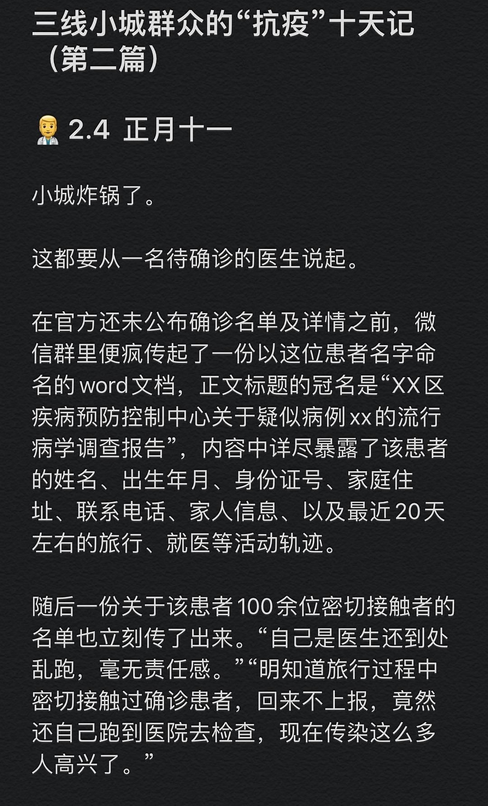
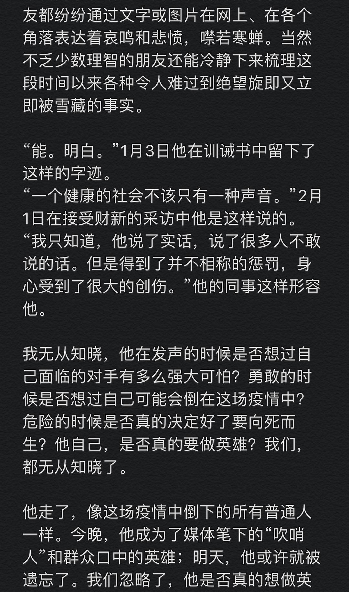
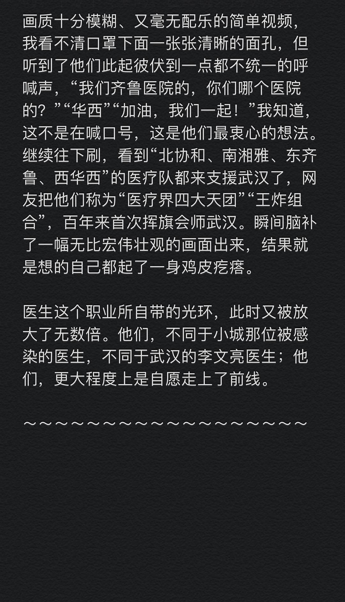

来源：[美猴王大世界（来自豆瓣）](https://www.douban.com/people/124451576/)的[广播](https://www.douban.com/people/124451576/status/2805135522/)

2020-02-11_22:55:15

三线小城群众的“抗疫”十天记 （第二篇）

‍⚕️2.4 正月十一

小城炸锅了。

这都要从一名待确诊的医生说起。

在官方还未公布确诊名单及详情之前，微信群里便疯传起了一份以这位患者名字命名的word文档，正文标题的冠名是“XX区疾病预防控制中心关于疑似病例xx的流行病学调查报告”，内容中详尽暴露了该患者的姓名、出生年月、身份证号、家庭住址、联系电话、家人信息、以及最近20天左右的旅行、就医等活动轨迹。

随后一份关于该患者100余位密切接触者的名单也立刻传了出来。“自己是医生还到处乱跑，毫无责任感。”“明知道旅行过程中密切接触过确诊患者，回来不上报，竟然还自己跑到医院去检查，现在传染这么多人高兴了。”

第二天，这位医生患者正式出现在了官方的确诊名单里。

因为旅行回来没有第一时间上报单位和社区，因为自己驾车去了医院而未被确诊，因为是一名医生。他被推上了小城舆论的风口浪尖。

🧑‍⚕️2.6 正月十三
前天小城的一位医生被确诊，这一天远在千里之外的武汉的医生——“吹哨人”李文亮走了。

从晚上十点左右爆出第一波消息后，朋友圈和微博舆论迎来了“大地震”。关于去世时间在此不想过多申诉重复，大家心里都记得。

其实这只是我第二次了解到李文亮这个医生的名字，第一次是在某天刷微博过程中看到某明星转发了他1月31日的微博，才知道原来这是一名眼科医生，原来他是最早发现冠状病毒并遭到训诫的八人之一，原来他不幸也被感染。然后就刷过去了。再看到他的消息，万没想到竟是这样的消息。
本科同学、研究生同学、各阶段同事、朋友都纷纷通过文字或图片在网上、在各个角落表达着哀鸣和悲愤，噤若寒蝉。当然不乏少数理智的朋友还能冷静下来梳理这段时间以来各种令人难过到绝望旋即又立即被雪藏的事实。

“能。明白。”1月3日他在训诫书中留下了这样的字迹。
“一个健康的社会不该只有一种声音。”2月1日在接受财新的采访中他是这样说的。
“我只知道，他说了实话，说了很多人不敢说的话。但是得到了并不相称的惩罚，身心受到了很大的创伤。”他的同事这样形容他。

我无从知晓，他在发声的时候是否想过自己面临的对手有多么强大可怕？勇敢的时候是否想过自己可能会倒在这场疫情中？危险的时候是否真的决定好了要向死而生？他自己，是否真的要做英雄？我们，都无从知晓了。

他走了，像这场疫情中倒下的所有普通人一样。今晚，他成为了媒体笔下的“吹哨人”和群众口中的英雄；明天，他或许就被遗忘了。我们忽略了，他是否真的想做英雄，抑或他只是想做他父母的儿子，他两个孩子的爸爸，他妻子的丈夫，他家里的顶梁柱，一个健康社会里的公民，而已。
人们能记住这个真正的英雄多久呢？

然而，这个英雄的离开并未在小城掀起任何波澜。他的风头，在这里早就被那个确诊的本地医生盖过去了。

‍⚕️2.8 正月十五
“医疗界四大天团会师武汉”登上微博热搜。
此前已经许久不玩微博了，尤其在香港更是与微博说再见了，只是偶尔想起来刷刷八卦娱乐以免自己太落伍。但是，最近又开始频繁去看了。每天睡到日上三杆醒来第一件事刷朋友圈看看昨晚又刮了什么新风向，第二件事就是打开微博看热搜的前日新增人数以及扫一扫其他的热搜消息，平日白天拿起手机也会时不时打开微博热搜榜挨个点开看下。虽然质跟不上，但毕竟体量在那里，消化得也会快一些。

这一天，一段仅15秒的华西医院和齐鲁医院援鄂人员在武汉机场隔空问好的视频，让我看得双眼湿润了。只是一段手机拍摄的、十分不专业的、甚至镜头抖动厉害、画质十分模糊、又毫无配乐的简单视频，我看不清口罩下面一张张清晰的面孔，但听到了他们此起彼伏到一点都不统一的呼喊声，“我们齐鲁医院的，你们哪个医院的？”“华西”“加油，我们一起！”我知道，这不是在喊口号，这是他们最衷心的想法。
继续往下刷，看到“北协和、南湘雅、东齐鲁、西华西”的医疗队都来支援武汉了，网友把他们称为“医疗界四大天团”“王炸组合”，百年来首次挥旗会师武汉。瞬间脑补了一幅无比宏伟壮观的画面出来，结果就是想的自己都起了一身鸡皮疙瘩。

医生这个职业所自带的光环，此时又被放大了无数倍。他们，不同于小城那位被感染的医生，不同于武汉的李文亮医生；他们，更大程度上是自愿走上了前线。

～～～～～～～～～～～～～～～～～～

致敬奋战在一线的所有医护人员，在疫情爆发一个多月的今天，道一声你们辛苦了。
正是有你们在风雨兼程，我们才能在家乖乖隔离。
  

  

  

  

  

  

