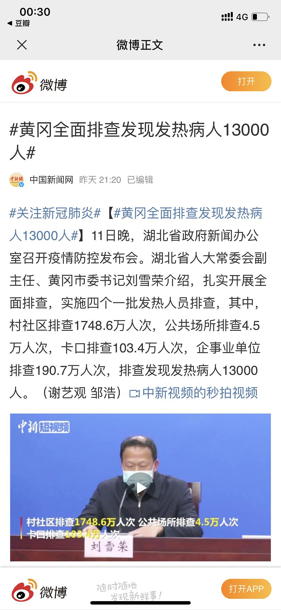

来源：[ASUKALC 穷折腾（来自豆瓣）](https://www.douban.com/people/Kidew/)的[广播](https://www.douban.com/people/Kidew/status/2805398326/)

2020-02-12_00:37:56

社区排查？怎么查：
第一次：你们家几个人啊，有没有去过武汉啊。
第二次：来，你们填个表登记姓名和电话。
第三次：送你们四张通行券，一定要带着。
不说量体温，问都没问过这就能排查出13000？
  

