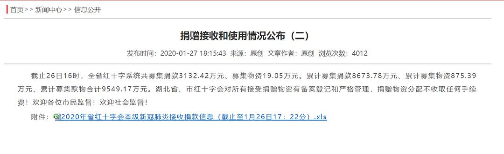
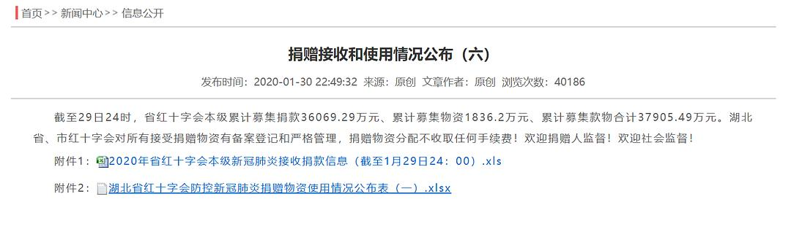

来源：[信息公開多醞藉（来自豆瓣）](https://www.douban.com/people/130263193/)的[广播](https://www.douban.com/people/130263193/status/2805499287/)

2020-02-12_01:29:24

湖北省➕，你们是在糊弄鬼吗？？？
本来想趁着深夜整理➕的公示材料，来到官网下载公示信息，没想到从公示一到公示七，从1月25日到31日，附件里的Excel文档都是同一个，都是一模一样的。
所有的表格，开头都是“2020年新型肺炎捐款信息（截止至1月26日17：22分）”，结尾都是“合计38422322.24”。我想请问，你们就是这样公示信息的吗？
（以上都是本人实操所得，欢迎转发，有质疑的友邻请自己去下载验证）
  

  

  

  

  

  

  

  

  

