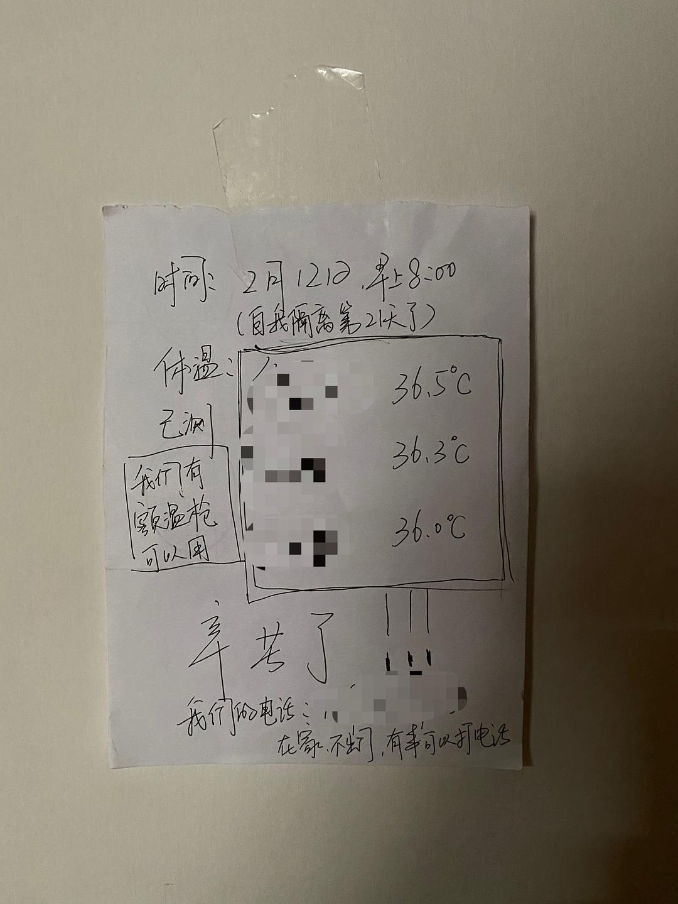

来源：[原地吃素的猫饭（来自豆瓣）](https://www.douban.com/people/cute_ann/)的[广播](https://www.douban.com/people/cute_ann/status/2806585527/)

2020-02-12_17:58:29

2月12号 隔离第21天

昨晚好朋友建议我贴一张写有自测体温数据的纸条在门外。今天一早起来测完体温就贴上了，果然就没人敲门了。希望能安安稳稳一直到疫情结束。🙏
  

