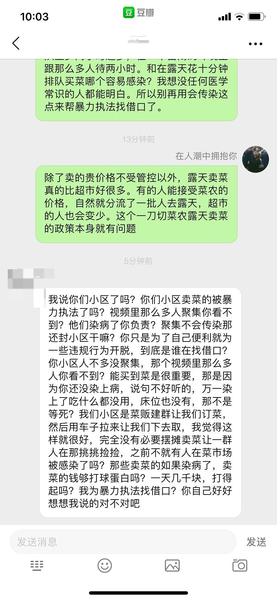

来源：[在人潮中拥抱你（来自豆瓣）](https://www.douban.com/people/lissazheng/)的[广播](https://www.douban.com/people/lissazheng/status/2807925439/)

2020-02-13_10:13:10

我算是知道什么叫站着说话不腰疼了。
首先我们说聚众的问题，造成他们凌晨四点扎堆买菜卖菜的原因是什么？
难道不是因为懒z恶f一刀切不允许这些菜贩卖菜吗所以迫不得已只有乘着天亮赶来吗？如果允许，这些买菜的人可以根据自己时间过来，自然不用聚众。

其次即使聚众，这里的人也比超市的只会少不会多，超市还是一个密闭的空间。你仔细想想哪个概率高？

再次，不是所有人都住在一个可以订到菜的小区，也不是所有人都会用微信卖菜买菜。您指责他们之前最好先思考一下是不是每个人都有这个条件。

最后，懒z恶f就是这样，一刀切了然后不管不顾，这样的规，有人违反了首先该质疑的应该是规则的合理性而不是被暴力执法的人。
  

