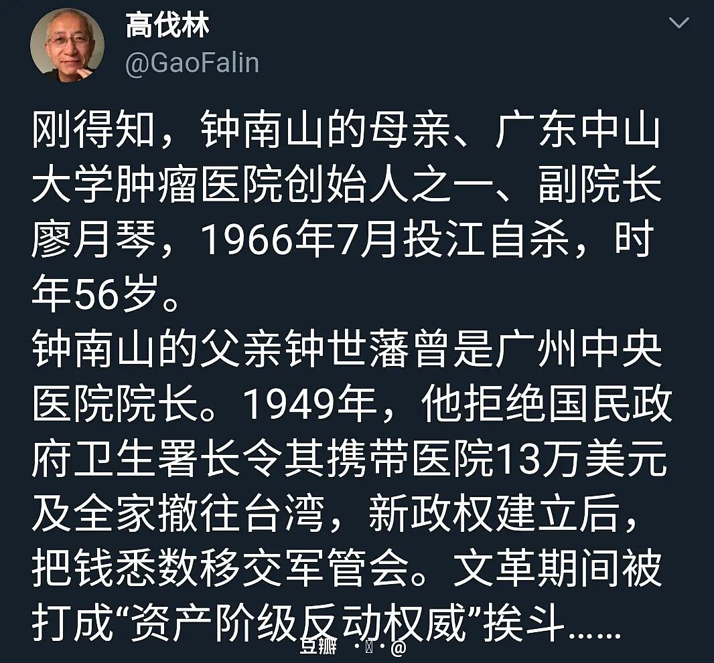

来源：[斯文的🌹玫瑰（来自豆瓣）](https://www.douban.com/people/203577899/)的[广播](https://www.douban.com/people/203577899/status/2810082581/)

2020-02-14_12:02:44

他被使用在远离文化中心的地方，
又被他的将军和他的虱子所遗弃，
于是在一件棉袄里他闭上眼睛
而离开人世。人家不会把他提起。

当这场战役被整理成书的时候，
没有重要的知识会在他的头壳里丧失。
他的玩笑是陈腐的，他沉闷如战时，
他的名字和模样都将永远消逝。

他不知善，不择善，却教育了我们，
并且像逗点一样加添上意义；
他在中国变为尘土，以便在他日
我们的女儿得以热爱这人间，
不再为狗所凌辱；也为了使有山、
有水、有房屋的地方，也能有人烟。
（查良铮译）
  

