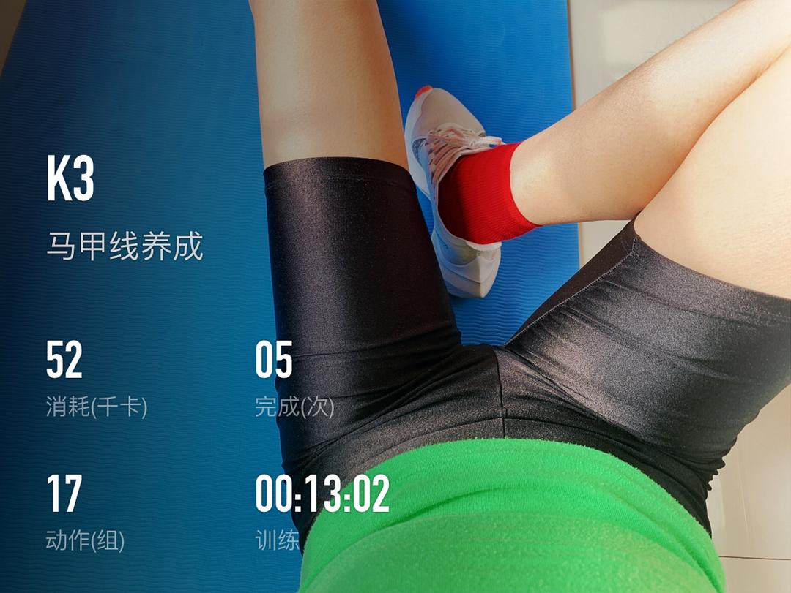
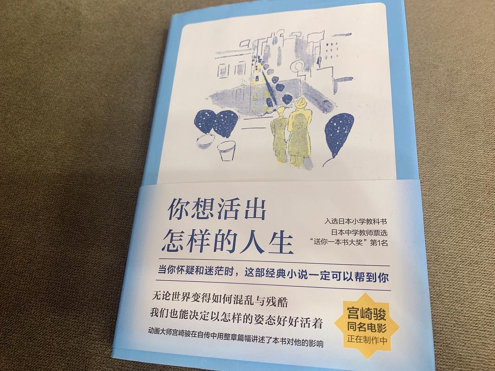

来源：[美猴王大世界（来自豆瓣）](https://www.douban.com/people/124451576/)的[广播](https://www.douban.com/people/124451576/status/2810938324/)

2020-02-14_20:22:18

运动，读书，写字，追剧。

————————————————
🧘‍♀️运动：keep
最近疫情期间特别推出了“居家解压健康计划”，运动量不大但是内容丰富，强度趋缓，主要以舒展拉筋为主，包括：瑜伽，太极，HIIT全身循环，以及上肢下肢腹部等专项训练，周期为两周，每周四天，适合打发居家隔离时光。

我最近开始捡起了马甲线，宅在家每天吃的多，脂肪摄入量也巨大😭“游泳圈”已经出来了，所以不得不把马甲线计划提上日程……本周已经坚持了五天，每天上午一次，约25分钟，非常能出汗，感觉练完肚子都小了一圈（错觉👀），很爽。

📖读书：《你想活出怎样的人生》
首先，封面里的《查令十字街84号》是三个月之前读的了，与这本小书实在有缘。
在书店逛了一圈机缘巧合看到这本藏在一堆新书后面的旧书，硬壳外面的书皮四边已经磨损的十分厉害了，毛毛糙糙，甚至边夹处已经撕裂了，稍一用力就会把它撕烂。不知被多少热爱它的人抚摸翻阅过呀……我就这样翻开小书，在书店找了个角落，用四十分钟一口气读完。若它并非一本“破书”，我或许根本不会光顾。

毕竟，它那么火，那么炙手可热。

毕竟，对于畅销书，我一概都是敬而远之，相敬如宾。

其次，我最近一直在读的其实是《你想活出怎样的人生》先别误会，这可不是一本所谓的励志鸡汤毒品哦。这是之前在北师大参加“新经典”校招时他们送给每位同学的一本书，也是当时他们出版社最新做的一本书。扉页上介绍，是宫崎骏小学第一次在教科书中读到节选便爱不释手的一本书，也是宫崎骏同名电影的故事。

后来回家后由于面试、工作、旅行等各种事情一直被我丢在了一旁，最近隔离期间，开始翻书架上没读过的书拿出来读，找到了这本书。作者以一个中学生的口吻和视角来书写日记般记录生活的故事，天真可爱中又不失能引发我们思考的真性情。我更愿意把它归为一本儿童读物，既能启蒙孩子，也能启发家长，亦能感动我这种未婚单身的成年人。

一直偏爱日本小说和散文，里面关于日本风景、社会、人性和生活的描写，总能温暖我。

✍️写作：
一方面记录我的疫情日记，虽然被困在武汉千里之外的一座北方小城市，尽管我看到的听到的和亲身经历的有那么多不尽如人意，但这里是我的家乡，我出生的地方，我生活了18年的港湾。在抗疫过程中，有那么多温暖的普通人：小区门口负责登记守卫的保安叔叔，城市街道负责喷洒消毒液的环卫工人，驾驶救护车出入最一线的医院和疑似及确诊病例家中的急救人员……他们跟我一样是这个小城最普通的居民，跟我又不一样是在这特殊时期行走在这个城市里点亮生活的无名者。希望你们平安。

另一方面，开始写布拉格、罗马游记了。那是我最欢乐的旅行，最难忘的时光。2019年元旦从香港出发飞布拉格，尽管刻意避开了圣诞和跨年，但浓浓的节日气氛依旧充斥了欧洲，尤其是布拉格这座靠近东欧白雪包裹的童话小城。

停留了五天飞罗马，有种误入“城乡结合部”的错觉。罗马是个古城，古到城市的任何一个角落都能看到拥有几千上万年历史的建筑遗迹；罗马又是个魔幻大都市，走在市中心奢侈品商店眼花缭乱，有种仿佛走进去我就能随便抓起来一只包肆意买买买的节奏。加之，意大利是个接收难民的国家，各个肤色的人都可以汇聚在这里，好不热闹但又内心恐慌。毕竟，是个胆小的女人。

📺追剧：《奈何boss要娶我》
是的，我追了一部甜爱无脑齁死人不偿命的网剧……

前段时间看了《切尔诺贝利日记》恐怖电影版以及共五集的美剧版，加之那段时间处在疫情最严重、收治最无力、网络求救最爆发、删帖最夸张的阶段，所有糟糕情绪几乎要把我淹没到窒息……看完这个根据真实故事拍摄的美剧后，更是郁闷情绪无法排解，就想着我需要转移下注意力了……这部甜剧就是在这种大背景下走进我的视野的。

拍摄较粗糙，演员演技也不是很在线，剧情很夸张，更别说贴进现实了？一点也不！有种高中时候闷在书垛后看一本五六百页的韩国网络言情小说的即视感，其实这部剧就是完完全全改编自那类小说的。所以整个过程不需要动脑，就像个老阿姨跟着呵呵傻笑就好了，不得不说这部剧真的取悦到我了哈哈哈😄
  

  

  

  

