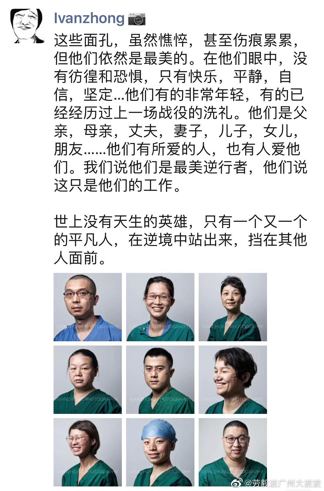

来源：[广志（来自豆瓣）](https://www.douban.com/people/ratmickey/)的[广播](https://www.douban.com/people/ratmickey/status/2814550378/)

2020-02-16_13:00:43

锐钧兄跟我同校同届同层宿舍，但他并不是新闻系的。凭着对摄影的喜爱毕业后成了一个新闻摄影记者。还有一位师兄张由琼，也在南都。现在他们都成为中坚，成了读书时我们仰慕的人。他们用镜头记录英雄，他们也是我们心目中的英雄。
  

  

