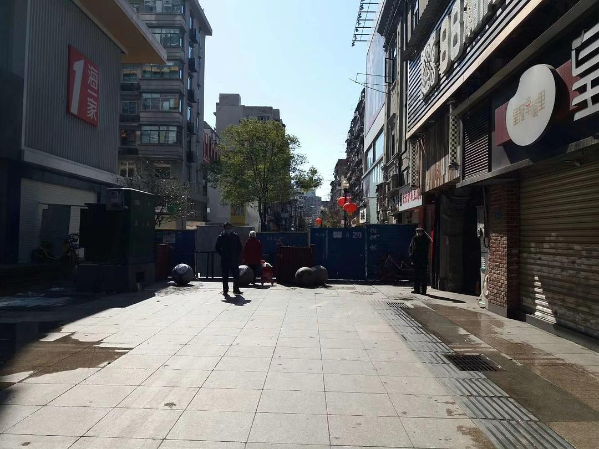
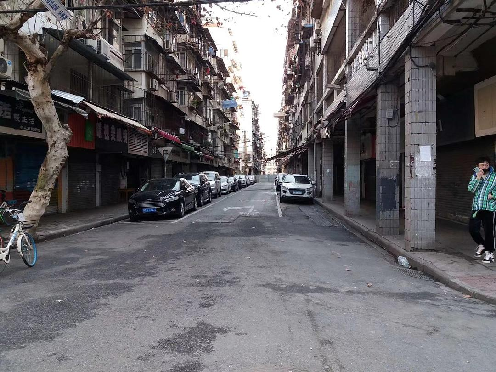
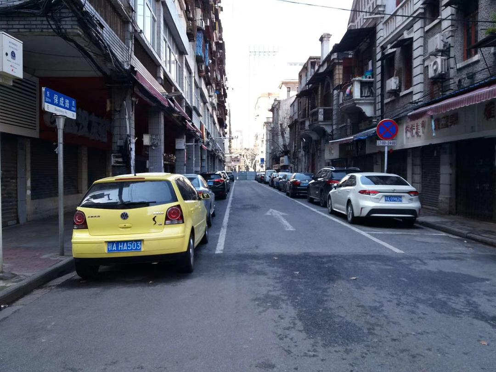
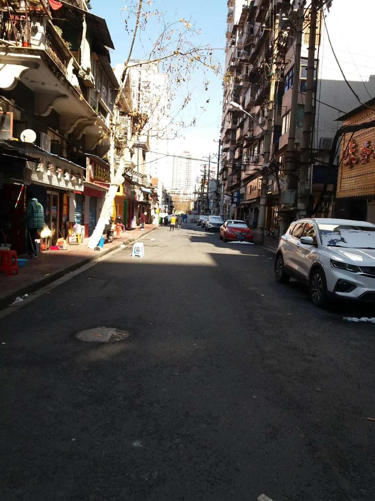
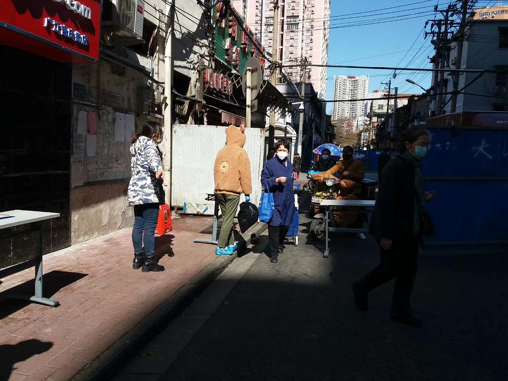

来源：[欢喜陀（来自豆瓣）](https://www.douban.com/people/sunwukong/)的[广播](https://www.douban.com/people/sunwukong/status/2814835695/)

2020-02-16_15:33:40

刚才从卧室下楼回工作室，发现几乎每个大点的路口都封死了，东南西北四个路口全部封死，简直有病，救护车也不打算进来对吧？找了半天，只有保成路留了一个口子，社区告诉我们今天是最后一天买菜，多买一点，后面就全部封死，看来我得小搬一次家了，睡觉和吃饭的地方不在一栋楼（隔着一条街），还要搬电视机和碟机。

封在卧室那边的话，家里养的植物估计全部得死光，真的很想骂人，这都是哪个出的馊点子？

刚才问社区的，封死了我到哪里买菜？他说隔一段时间可能会定点配送基本口粮，但是同时强调说:“我并不确定”。至少说明他们至今没有接到会定点发放口粮的通知。前段时间不是说“封楼送菜”是谣言的吗？确实是谣言，因为只对了一半，封楼是真的，菜不是免费的，而且还不一定有。

我还是囤几箱泡面最保险，不会做饭，而且家里连炒菜的锅都没有，没有炉子，也没有蒸米饭的炊具，如果到时候只送菜不送泡面，我只想知道有没有人送铁锅，我要拿锅砸他的头!
  

  

  

  

  

  

