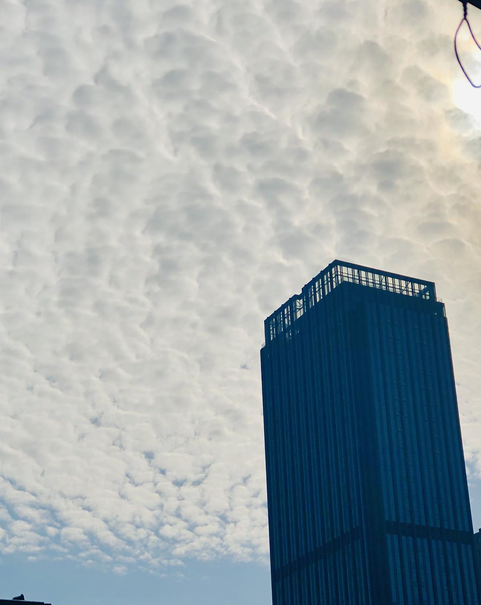

来源：[陈星宇作词（来自豆瓣）](https://www.douban.com/people/chenxingyu2009/)的[广播](https://www.douban.com/people/chenxingyu2009/status/2815340779/)

2020-02-16_19:57:02

【星星日记：20200216武汉封城第二十五天】
今天天气太好了！
昨天大雪大风一场，今天就雪后暖阳普照了一天，真是舒服啊！
对于yi～qing的新闻，今天漂了一眼，不想细看了。。。不过总体明显向好是可以感觉出来，湖北以外的地区新增已经明显向下了，至于湖北和武汉看月底和下月初吧。
社区管的确实严格了一些，不过买菜的问题，还是很头疼。。。
今天一下午，坐在窗口晒太阳，继续看我的新书《江汉关传奇》。时间静谧，过流轻快，心情略缓。
  

