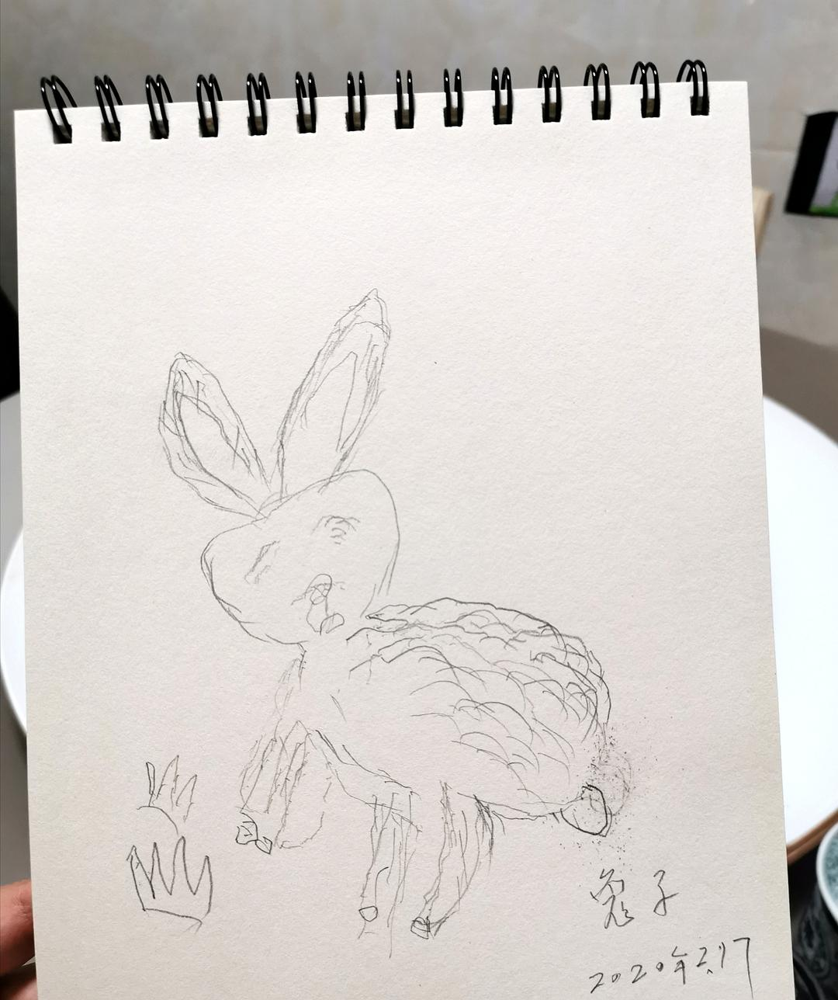

来源：[shane（来自豆瓣）](https://www.douban.com/people/37164735/)的[广播](https://www.douban.com/people/37164735/status/2818006103/)

2020-02-18_00:47:04

疫中日记 15

今日全市新增1例，是之前确诊病例的密切接触者。像这样的新增不太会触动人们的神经了，能刺激大家的是新冒出来的那种病例。

今日女儿想要用水彩笔画画，我戴上口罩出门给她买画笔。一出巷子口，发现老街不少店开门了。文具店，移动营业厅，精品店，好多家。街上的人也比之前多了一些。
文具店老板娘在理货，老板站在店门口，两个人都戴着口罩。挑东西的时候，听见街上有个女人对老板喊话：“我一会儿过来买笔，你会关门吗？”老板回了一句：“不会！”老板娘嘀咕：“那谁啊？”老板笑了一声：“都戴着口罩，谁认识谁？”

买了一套水彩笔，两本素描本，两支铅笔，一块橡皮，我回到了家。
女儿选了一本粉色小花的本子，用水彩笔画了一个手掌城堡。她还不太会用笔，不喜欢手腕贴着纸用力。很多线条歪歪扭扭，但这就是孩子的画。奶奶在旁边一阵赞美。
我趁机说：“宝贝，你和姥姥一人画一幅画，比赛看谁画得好吧！”女儿欣然同意。奶奶也应了下来。

我拆开另一本素描本，放在餐桌上，让奶奶坐下画画。奶奶一边说：“我不会画呀！”一边拿起来铅笔。
我说，你们一人画一只兔子吧！女儿高兴地画了起来。奶奶也开始认真地画。她的笔触很轻，一边画一边说：“这只兔子是趴着的。”

女儿画完以后，拿着画过来比。
她说自己的画100分，姥姥的画只有10分，所以她是第一名。
可我觉得，一个80多岁的老人拿笔画画的样子也是100分呢。
  

  

