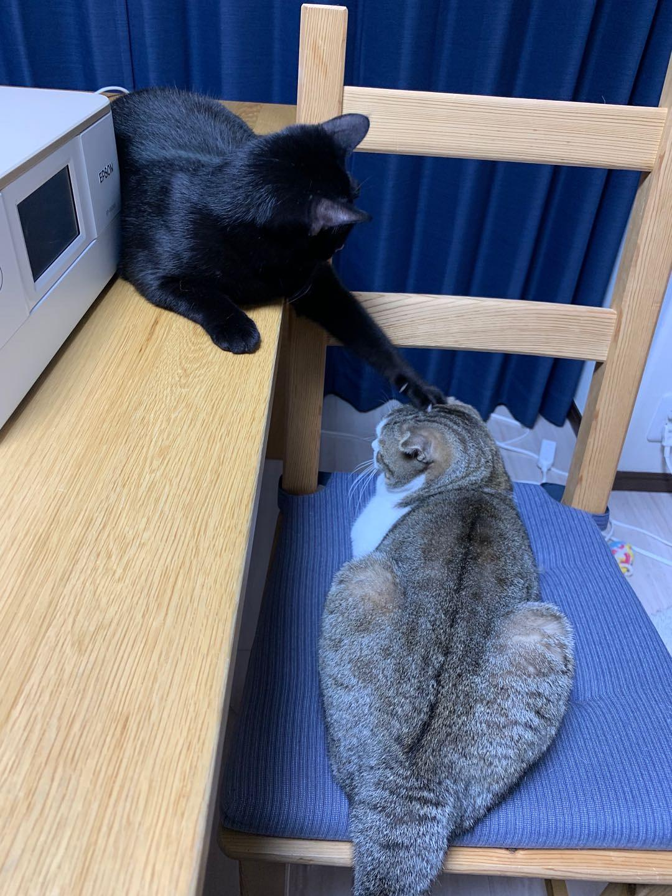
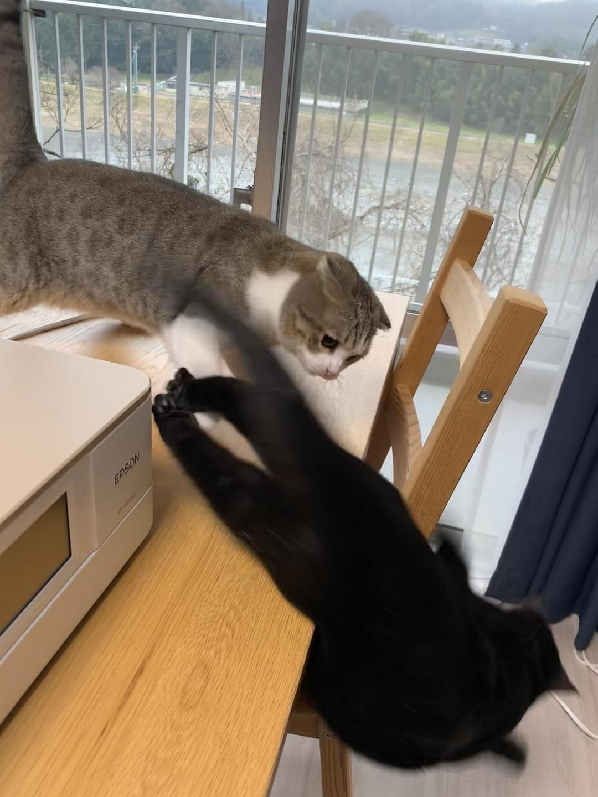

来源：[河边（来自豆瓣）](https://www.douban.com/people/wangshazi/)的[广播](https://www.douban.com/people/wangshazi/status/2819259397/)

2020-02-18_19:42:32

刚跟一个日本人通电话聊了一个半小时，我不停地强调病毒有多凶险，做好防护多么重要，扩散有多快，多少家庭有多惨。她一开始支支吾吾都说什么不就跟流感差不多嘛，口罩已经买不到了啊什么的。最后可能看我苦口婆心实在难得，就直接跟我坦白了：其实大家不是不知道媒体宣传故意轻描淡写，也不是看不到中国方面的报道，但是与病毒相比日本人的心里承受能力更让人堪忧，如果如实说了，有些人会不安得需要服药，有些人会抢购物品导致更大的恐慌，日本人承受能力实在太糟糕，可能病毒还没严重，人就没了（自杀）。所以，大部分人都支持媒体淡处理。
  

  

