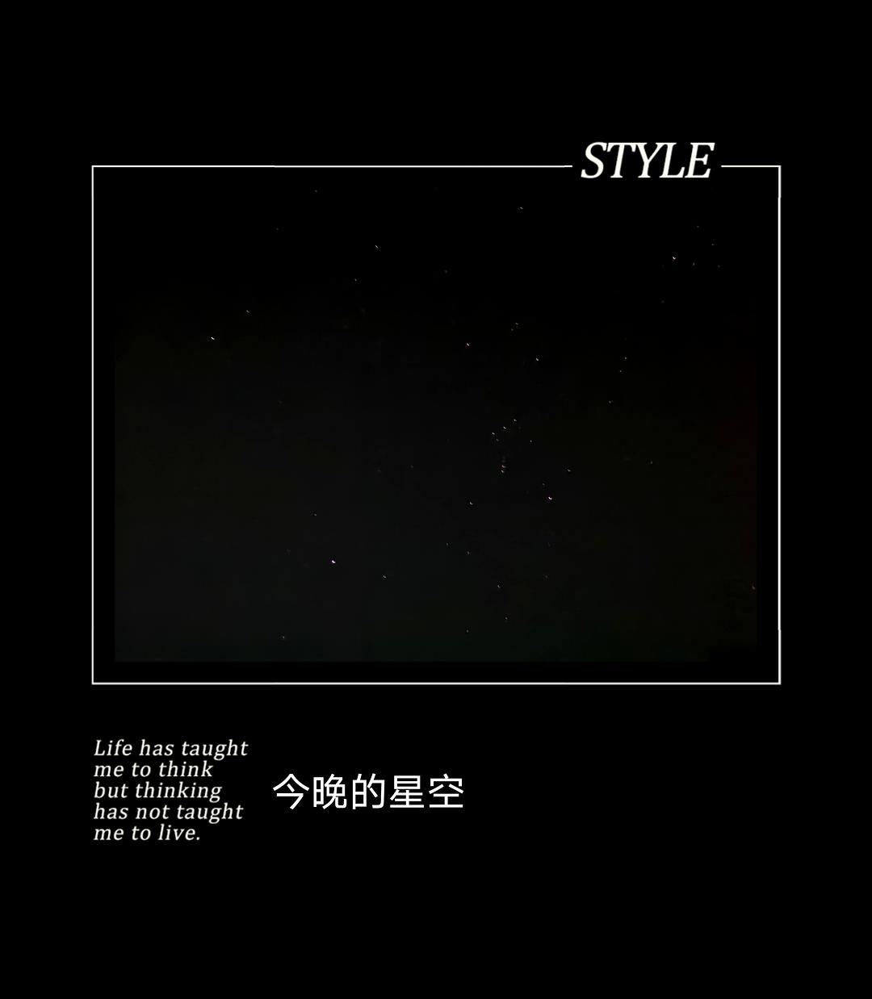

来源：[shane（来自豆瓣）](https://www.douban.com/people/37164735/)的[广播](https://www.douban.com/people/37164735/status/2819964569/)

2020-02-19_01:07:44

疫中日记17

今早在被窝里接到单位的电话，下午要去单位开会。于是九点多就慢悠悠起床了。老妈得知我要进城，于是吃过水饺早餐以后，她又很快准备起了午餐。

化妆品护肤品都在市区家里，我用这边仅剩的一点粉底霜简单打了个底，画了下眉毛，最后从包里找出一只唇釉，就算是化好妆了。
女儿跑过来抱着我撒娇，用力地亲了一下我的嘴巴，然后问：“我也有口红了吗？”

午饭过后，我戴了一个新的医用一次性口罩出门。今日阳光很好，街道似乎更有生气了一些，有了车辆穿梭的声响，也有了人们大声的对话。
我一边出门，一边打电话叫出租车。很快有司机接单了。我顺利穿过了设在广场旁边的检查岗，没有人过来找我测体温，也没有人问我要出入证明。
如果不是街上的人都戴着口罩，似乎已经让我们感受不到紧张的氛围了。

的士司机也戴着口罩。一路上我和他有一句没一句地聊着。他说出来跑车的的士不多，他一上午在城里只打到两个表，因为街上人太少了。
他一边开着车，一边和一个女孩子聊着微信。女孩子在微信那头说：“你想带点菜过来就来吧，你要是不来，这段时间我都懒得做饭的。”
一路上，他又顺带带了两个客人进城。车上人多，大家也就不再说话了。

到了单位，进门的时候保安正坐在门口。测了额稳，登记了名字，时间，单位，才可以上楼。
下午单位的会议从2点30开到了5点，依旧没有开出什么实质性内容。

到了下班的点，老公接我回家。路上，他又临时接到单位开会通知，于是把我放在市区家里，他先去开会了。
我收拾了几本女儿想看的绘本，拿了我的护肤品，又带上了小姑之前做给我的一大瓶霉豆腐。放好以后，趁着有时间，我去了趟附近的小超市。
超市零食架上有不少空格，这在以前是不可能出现的场面。超市的小姐姐认出了我，给我推荐了几样搞活动的特价的小零食。挑了一堆好吃的，我终于心满意足地回家了。

我们开车回老家的路上，他电话一直没停。他的岗位明天就要调整了，要从后勤部转到医保办了。
他有些焦虑，我安慰他，踏踏实实干干净净做事，总归是可以做好的。

一路上我们吃了不少小零食。到家已经快七点了。女儿看到我们带回的东西非常高兴，一直到睡着都没有问我，为什么京东买的剪刀还没有送到。

今晚星空很美。我和女儿一起去在楼顶看星星。女儿说，太多了，她有点数不清。又说，太好看了，星星有些是圆形，有些是爱心形，有些是星星形。

是的，慢慢的，我们的生活里又开始有了快递，网购，上班，酸奶，零食……
疫情的乌云似乎正在慢慢从我们的头顶散开，而我们，正谨慎而缓慢地迈出步伐，试探着这个世界是否真的安全。

单位门口的体温监测，卫生间的消毒湿巾，超市里的84液味道，戴着口罩的每一个人……都还在提醒着我们——危险和担忧仍然还在。
  

  

  

