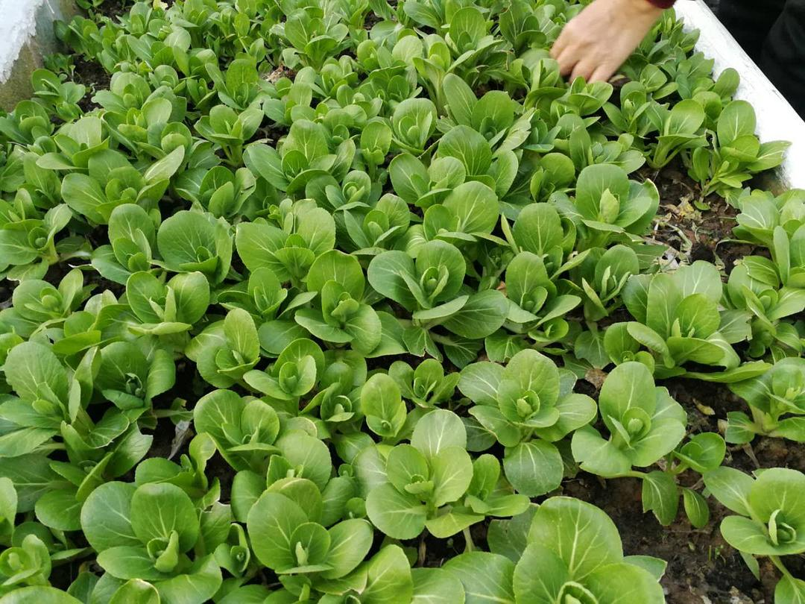
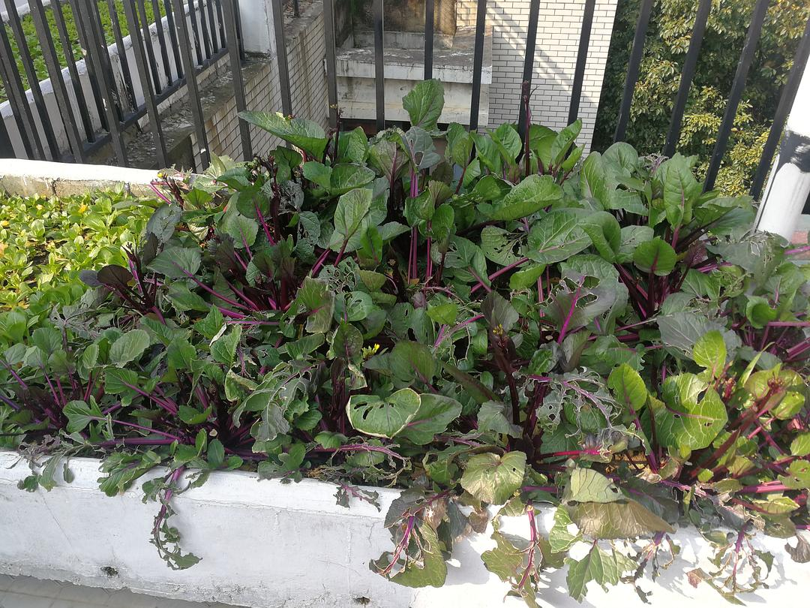
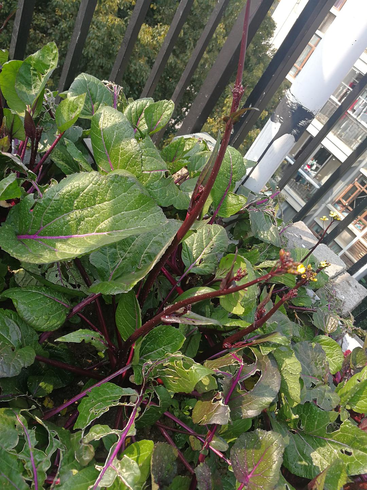
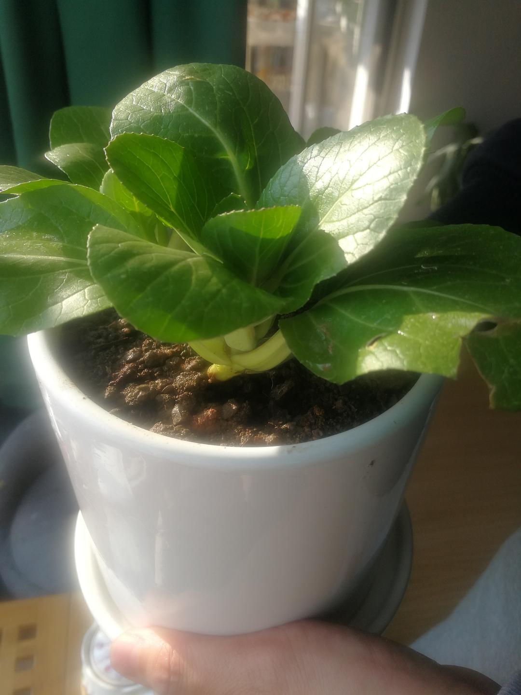
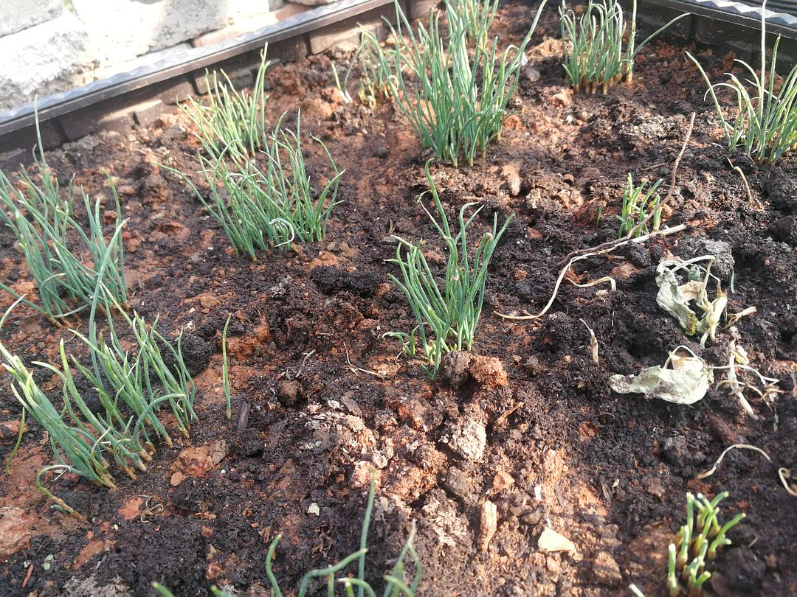
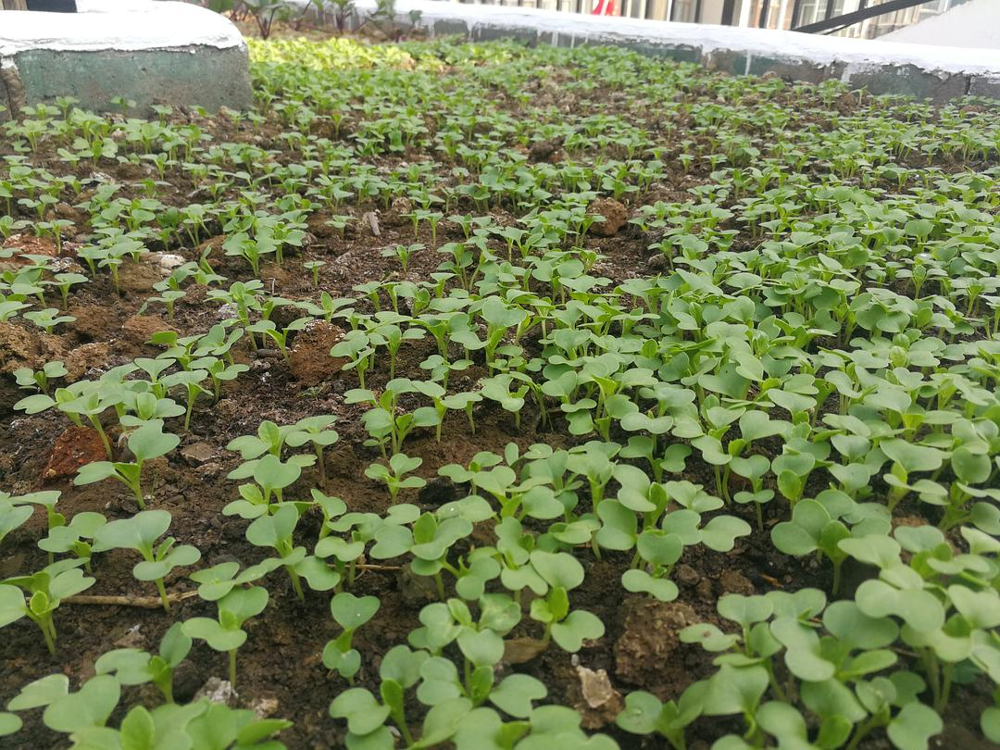

来源：[小样麻麻（来自豆瓣）](https://www.douban.com/people/maxiaofan/)的[广播](https://www.douban.com/people/maxiaofan/status/2821082947/)

2020-02-19_18:56:17

我希望在封城的武汉，也能够有一点生活向阳的感觉，之前公婆在露台种的菜，菜苔在封城后吃了好几餐了，现在还可以再吃一餐。小青菜太密了，偶尔搞一点下面条吃也是不错的。生菜长出来了，今天分离了几颗种到阳台上，长大了估计武汉也就解禁了。另外今天还下了草莓和彩椒种子，期待发芽🌱
傍晚和公婆在露台上商量解禁了种点番茄 黄瓜 小米椒啥的，只是不知道买不买得到这些菜苗子。我以前是多么希望有一个充满花香的露台，现在看来，菜园似乎更接地气，搞不好就是救急的蔬菜了。
期待武汉，春暖花开！
  

  

  

  

  

  

  

  

  

