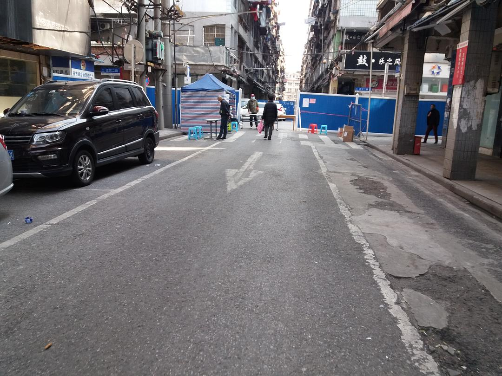
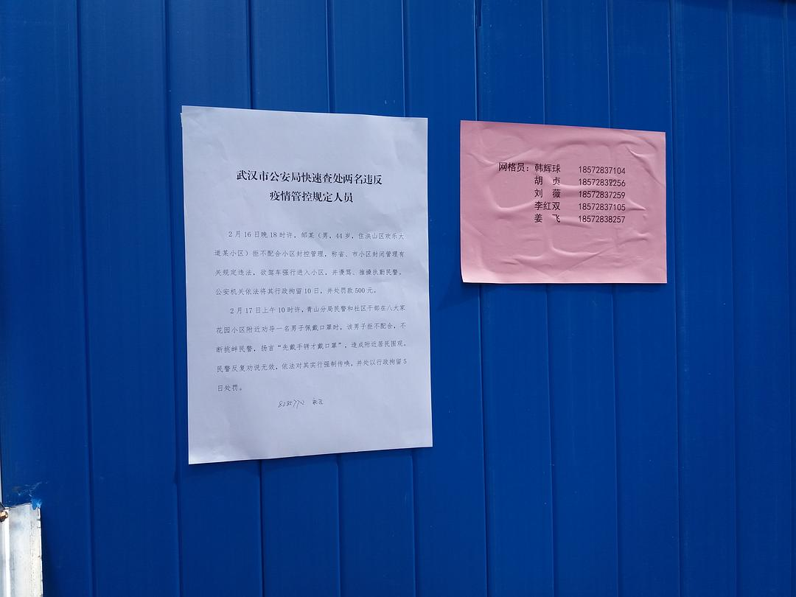
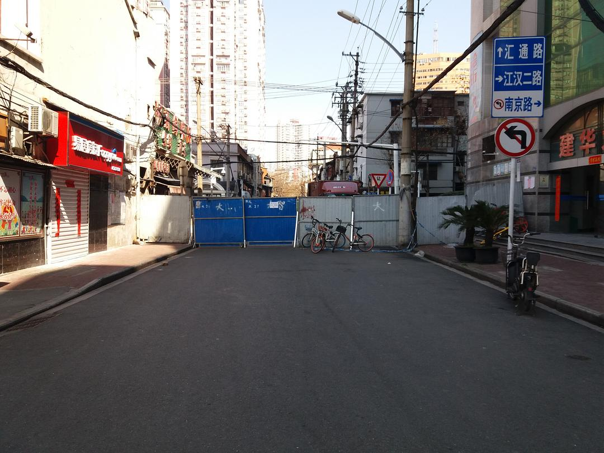
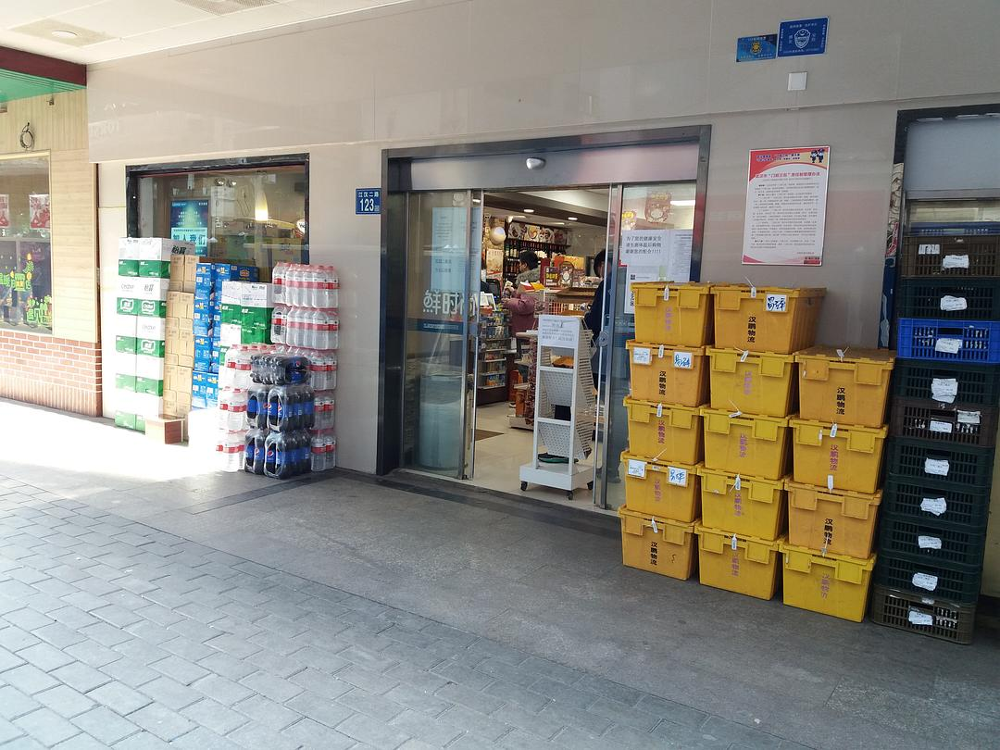

来源：[邓莹（来自豆瓣）](https://www.douban.com/people/1502959/)的[广播](https://www.douban.com/people/1502959/status/2822654417/)

2020-02-20_15:24:42

本来想回工作室拿几本好读的小说过来，《伊索寓言》啥的，现在小区全封闭，完全出不去，除非是病了才让出门，只好继续读这部难啃的大部头了，这种时候确实不太读的进去，比如说刚才进小区里的超市被打了体温枪，然后脑子里全是战争画面。。。。
  

  

  

  

  

  

