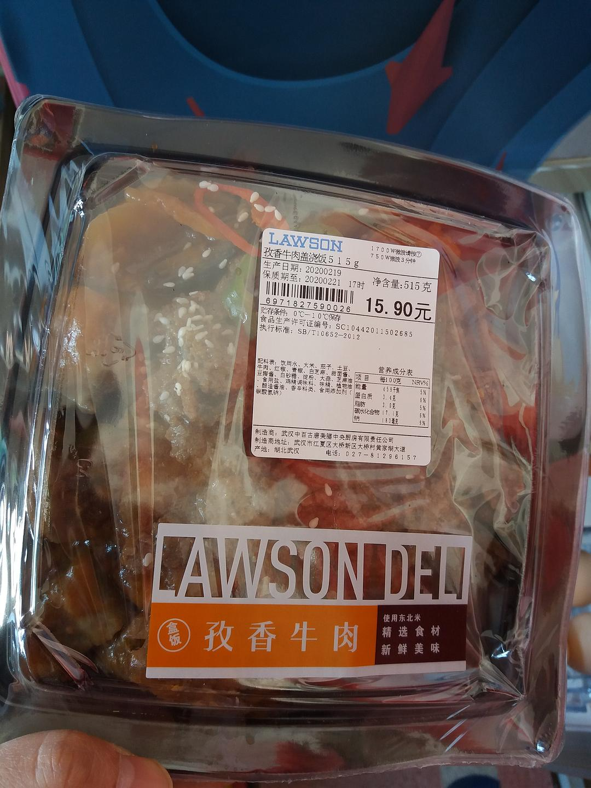

来源：[邓莹（来自豆瓣）](https://www.douban.com/people/1502959/)的[广播](https://www.douban.com/people/1502959/status/2822797432/)

2020-02-20_16:58:49

刚才想借口去工作室拿餐具溜出去晃晃，居然被工作人员认出来了，不让我出去，顿时感到武侠小说里的蒙面刺客都是骗人的。不过江汉路的社区总体来说比较有人情味，至少它封闭区间内的中百罗森是允许个人采购的，有的小区只能团购，我买了很多速冻包子烧麦三明治还有饭，幸亏带了个蒸锅过来。。。。

话说中百罗森的寿司真难吃，居然也被我吃完了，感觉是这一个月以来吃得最像饭的一次，终于吃到米了，已经连续吃了三天泡面了，不会做饭的人是要被病毒淘汰掉吗？晚上可以煮饭吃了，虽然对味道不抱很大期望，不过价格倒是很便宜。果然不用做饭是人生最大的乐趣呀，大概这就是我小时候对“自由”最早的概念。

记得小时候看一部美国电影，两个男人在聊天，一个女人走过来，男的骂道：“滚回你的厨房去!”我就想，那个女人为什么就不能和男人一起聊天，非得去厨房呢？不过长大后也知道，很多女人就是天生爱厨房的，这和自由无关。有人读书开心，有人做菜开心，因人而异吧。

最后说一句，豆瓣管理员连续删了我两条广播，真是太没幽默感了，你以为这是在方舱斗地主吗？
  

  

  

  

