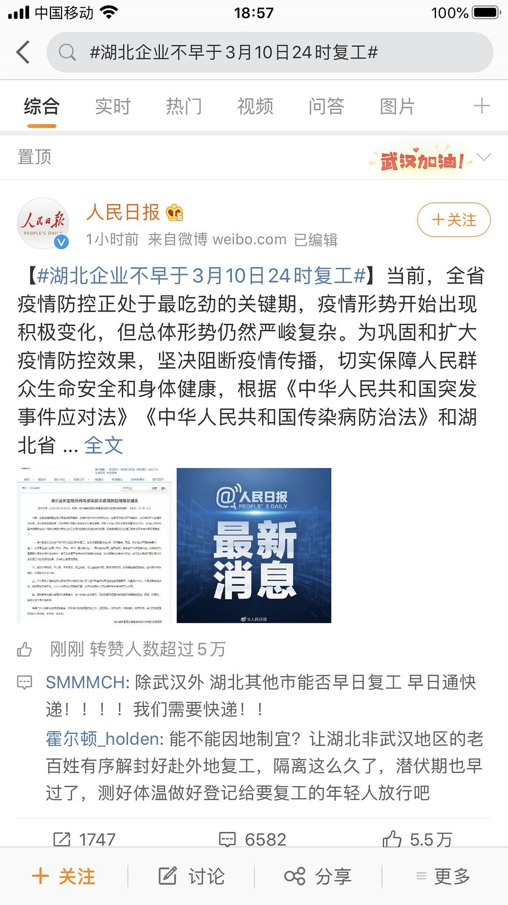
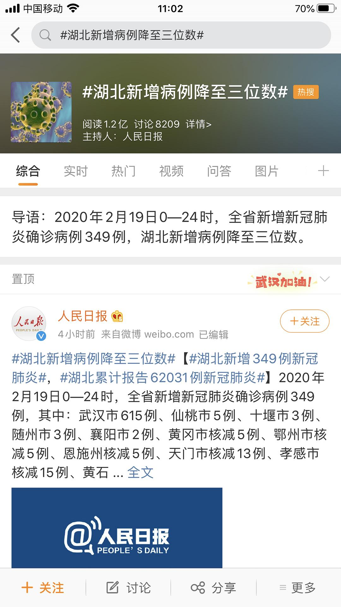

来源：[陈星宇作词（来自豆瓣）](https://www.douban.com/people/chenxingyu2009/)的[广播](https://www.douban.com/people/chenxingyu2009/status/2823050334/)

2020-02-20_19:29:39

【星星日记：20200220武汉封城第二十九天】
今天武汉的新增数字有615个，首次新增数字降到了三位数。除了湖北，其他省的数字也都大幅下降了，甚至为零了。这是一个值得高兴的变化。今天整日新闻都在大报特报这个现象。

另外一个事情就是湖北省复工时间通知，今天下午出来了，新的时间是3月10日。“假期充值了”。不过这个公告出来后，便有了很多不一样的声音，除了武汉的其他湖北城市的人，都想早点解封，早点继续工作。甚至网友间都出现了一些争执。哎，可以理解，但是这样的决定也毕竟是以大局为重。

这两天一直在注意日本钻石公主号，昨天有个日本医生在视频上发声，揭露了一些船上的事情，随即引发了一些声音，以及揭开了一些guanliao阴暗的一面，有网友称他为“日本的chui shao  ren "  ，也不知道是真是假，总之真不希望，武汉经历过的一些事情，再在其他地方重演。
  

  

