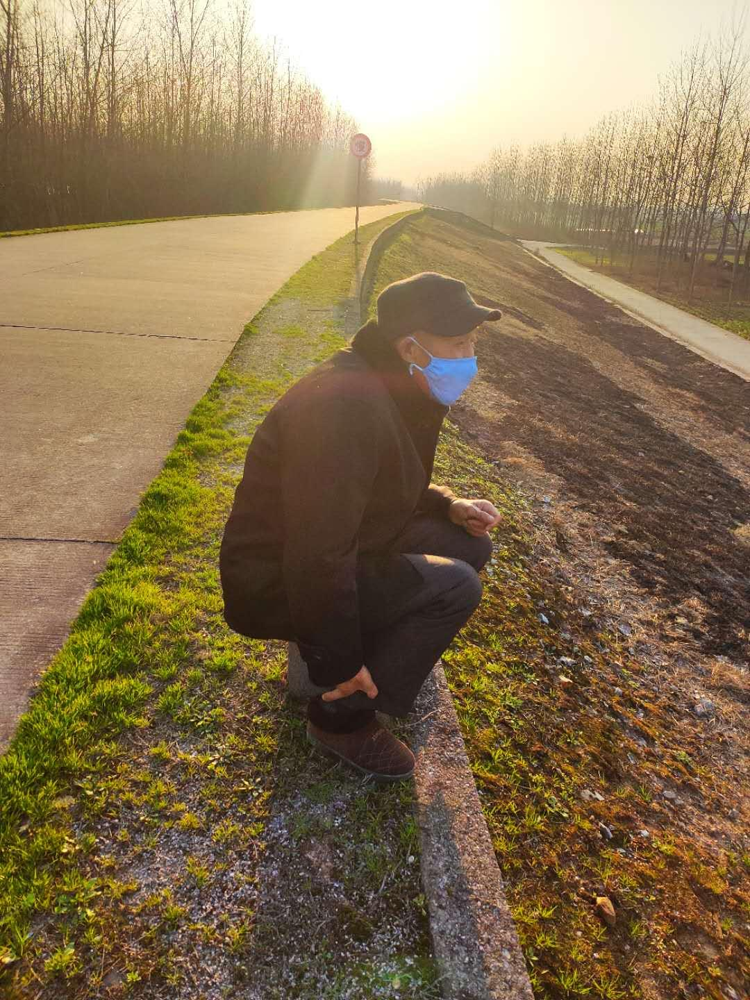

来源：[邓安庆（来自豆瓣）](https://www.douban.com/people/renjiananhuo/)的[广播](https://www.douban.com/people/renjiananhuo/status/2823180092/)

2020-02-20_20:32:27

黄昏时跟父亲在长江大堤上散步，走了半晌，父亲累了，找了个地儿坐下来。我问他在想什么，他说：“有时候觉得这样也蛮好的。”我问怎么个好法，他又笑笑，起身说：“我们再走走。”
  

