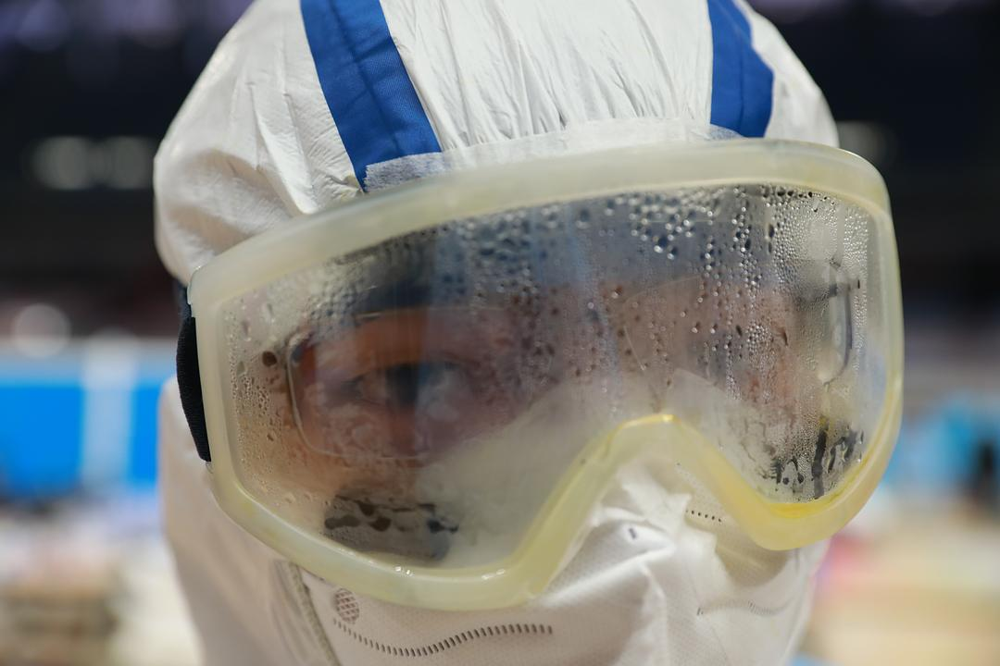

来源：[孟藻（来自豆瓣）](https://www.douban.com/people/58493958/)的[广播](https://www.douban.com/people/58493958/status/2825633726/)

2020-02-22_00:28:38

今天进了洪山体育馆方舱。第一次见到如此大规模的人生活在这片区域，医护也都感慨第一次护理这么多人。
最大的感觉是，这里充满烟火气，也充满希望。人们唱歌、跳舞，谈论今天的洗澡水热不热、各种家长里短。有抠脚的人，只穿肉色秋衣跑步的人，仿佛这里就是自己家。
我上了全套防护5小时，基本是医护人员一个班的时间，勒得我颧骨剧痛，到现在还脑壳疼，护目镜雾的情况如图。医护人员真的太不容易了。
  

