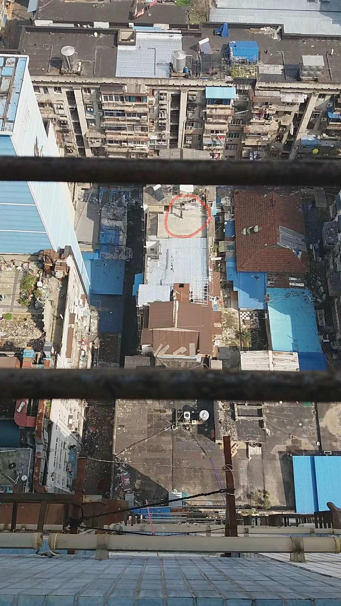

来源：[欢喜陀（来自豆瓣）](https://www.douban.com/people/sunwukong/)的[广播](https://www.douban.com/people/sunwukong/status/2826425576/)

2020-02-22_13:48:35

中午时一个摇滚戏迷在天台上唱《我是一只小小鸟》和《死了都要爱》《泡沫》等高音情歌，有网友回复说我这个视角很像“废土”，我跟他解释：

我这里是20层的高楼，往远处拍是高楼大厦和霓虹灯光旅游江景，往下拍就是老城区的屋顶，是被一圈高楼围住的矮旧老建筑，有些是历史建筑不能拆，会有些对比，这就是我说的“素面朝天的武汉”。这里四面环绕高楼的地形就像一个露天剧院，所以唱歌和吵架的时候会有种剧场的效果（视频见微博）
  

