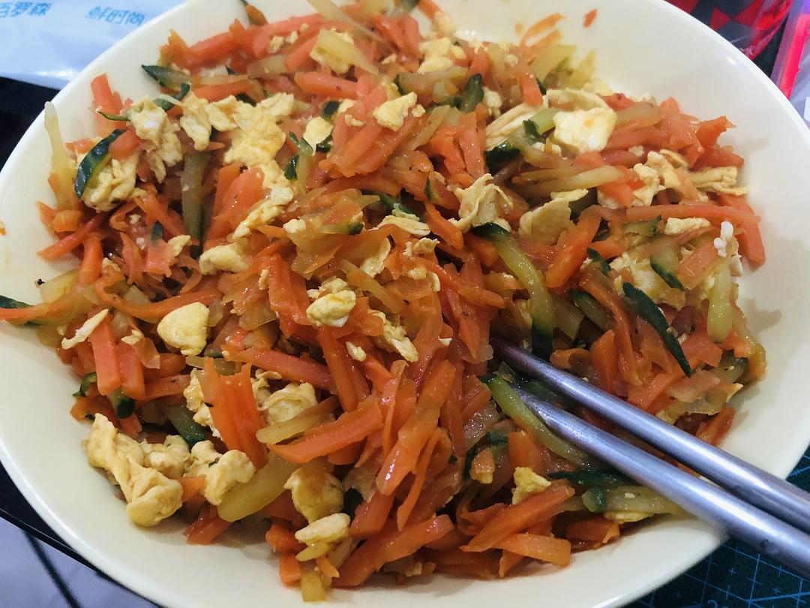

来源：[地味鸭（来自豆瓣）](https://www.douban.com/people/47513232/)的[广播](https://www.douban.com/people/47513232/status/2827154639/)

2020-02-22_20:23:28

Day31.今天才知道方方的伯祖父是汪辟疆，顺手搜到了已无词条的《软埋》，读了一些。作为小说并不见得很高明，然而这么些年来为什么只有她敢于去触碰这样的重要题材？一同被封在武汉、封在湖北的文人并不少，也只有她敢于公开说一些明明是常识的话，发一些老百姓最切身相关的问。我对现代、当代文学可以说相当无知了，但骨气消磨是绝对出不了好作品的。
封城到现在，最大收获是厨艺见长。等下去每日例行抢盒马，然后炖鸡汤。
  

