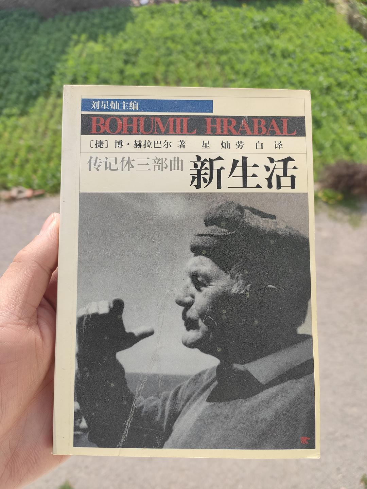

来源：[邓安庆（来自豆瓣）](https://www.douban.com/people/renjiananhuo/)的[广播](https://www.douban.com/people/renjiananhuo/status/2830841218/)

2020-02-24_16:44:24

回家时没想到会在家待这么长时间，带回的三本书都看完了。现在开启了重读模式，唐诺《眼前》、王安忆《天香》、朱天心《古都》……都是好些年前读完的书，放在家里积灰。现在又一次翻看，昔日阅读的愉悦感又一次涌起。这两天又翻到了赫拉巴尔的《新生活》，算是意外之喜。希望疫情结束后，未来能去赫拉巴尔的酒馆坐一坐。
  

