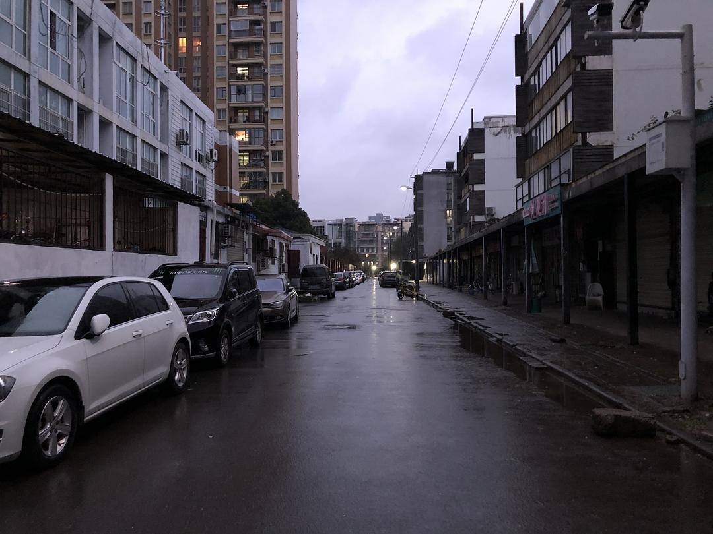
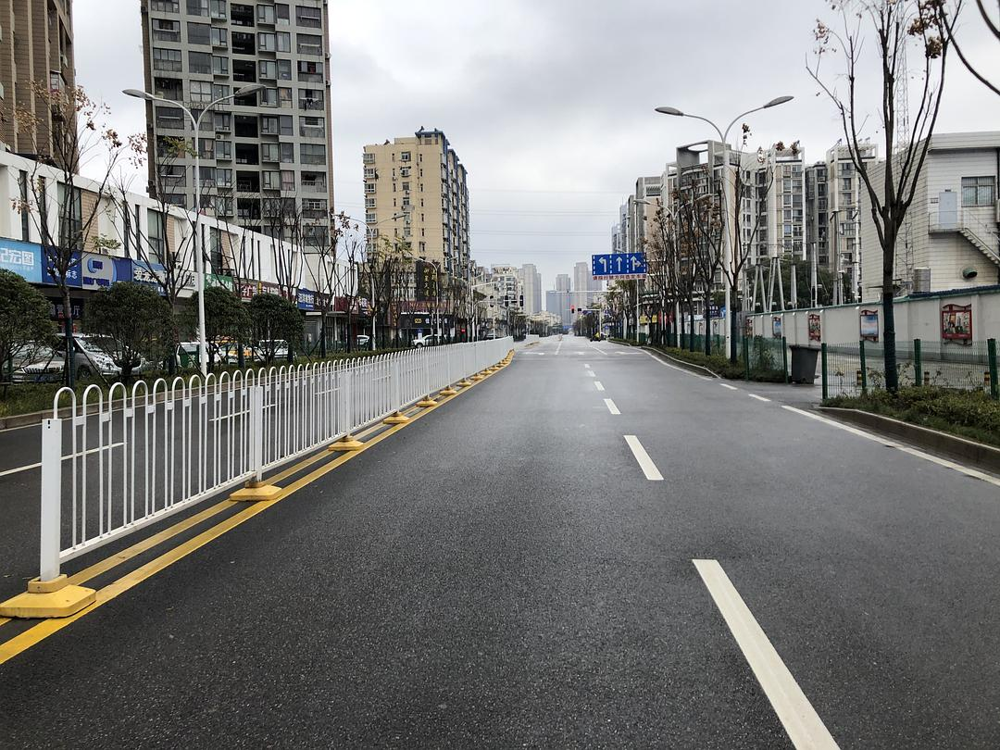
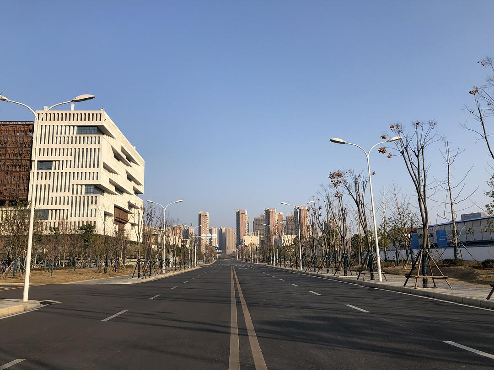

来源：[王鬼马（来自豆瓣）](https://www.douban.com/people/trouble-sleepin/)的[广播](https://www.douban.com/people/50729008/status/2831608592/#comments)

2020-02-24_23:48:22

武汉全面封禁前为数不多关于家之外的回忆。

图1:   1月25日，刚封城不久后，在家在家关了几天之后傍晚出门放风顺便采买。路上遇到3个附近大学的留学生试图在街边拦车，却一无所获。
图2:   1月26日，加入了猫咪援助群，出门帮附近小区的一对小情侣喂猫铲屎。后来基本隔几天就会去一次。第一次光明正大喊师傅开别人家的门锁。
图3:   2月4日，复工的官宣日子推迟，公司也开始要求大家在家办公，冒死回了一趟公司拿资料。第一次看原本应该坐满人却空荡荡的办公室。
图4:   公司大家收养的野猫大花。大家想着年后就回来，给它留了一大盘猫粮，大概够吃半个月。回去公司的那天大概太久没有看见熟悉的人了，一路跟着我走哪躺哪撒着娇。
图5:    1月31日，替小姐姐爱心喂完猫后在附近的大学里偷偷散心。戴着口罩，骑了辆小白，几年来第一次在早春看见武汉有这么蓝的天。
图6:    这个操场一直都是附近居民最爱来的地方。周末有学生在这里踢球、玩耍、唱歌，跑步的人特别多，现在毛都没有。
图7:   1月31日，喂猫的小区远远看见戴着口罩的老大爷在门口写大字。我不敢靠近，远远拍了张照便绕开走。
图8:    2月4日，路过超市对面的生鲜水果摊，那时候还没有全面禁出入，每家每三天可以派人出门采购物资。是疫情爆发后唯一看起来和平时差不多的场面。
图9:    2月22日，不能出门，只能站在露台上看看天看看树，感受日升日落。
  

  

  

  

  

  

  

  

  

