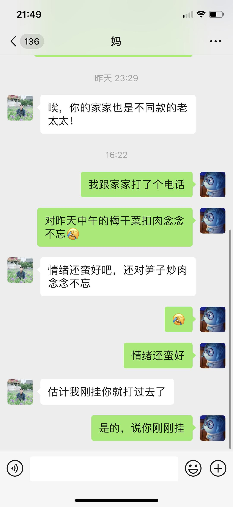

来源：[盘子（来自豆瓣）](https://www.douban.com/people/zhaoxun69/)的[广播](https://www.douban.com/people/zhaoxun69/status/2833185297/)

2020-02-25_22:03:53

家家在隔离点的第四天。电话中表示：“昨天中午的梅干菜扣肉蛮好啊，梅干菜是嫩嫩的，一点冇得老的，大大的一片肉切得飞薄，不晓得是哪里的大师傅做的，我都切不到这薄……”我：“好好吃饭但是荤菜要控制当心nia的胆囊～还有，不要看电视看到半夜了～”我家家瞬间：“我没有！我没有我没有我没有！”【图二是昨天一位豆友对看电视这事的评论😂】【PS：老太太说又有两层楼发现了确诊患者所以“今天又要来一大批来隔离的啊。”感叹了“你说这要闹到么时候……”】
  

  

