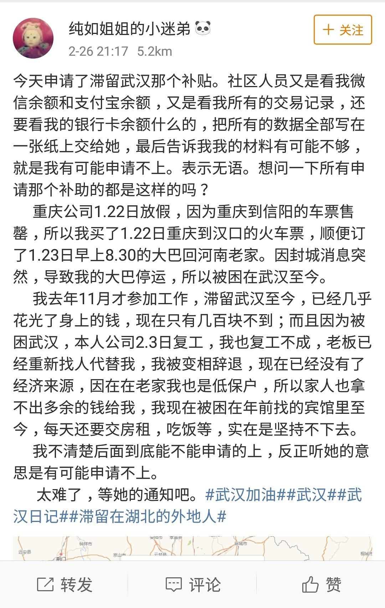

来源：[邓莹（来自豆瓣）](https://www.douban.com/people/1502959/)的[广播](https://www.douban.com/people/1502959/status/2836023373/)

2020-02-27_14:18:38

现在滞留在武汉的外地人员想要申请回家还是比较困难的，申请补贴也很困难。还有一些农民工没有地方住，睡在地下通道里，但是现在城市每天消毒，他们的被子被强迫浇湿，现在武汉夜晚的温度还是很低的。
  

  

  

