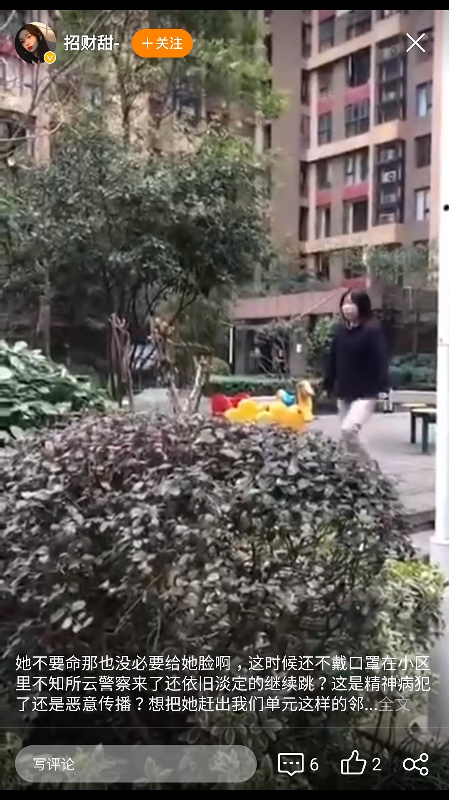

来源：[邓莹（来自豆瓣）](https://www.douban.com/people/1502959/)的[广播](https://www.douban.com/people/1502959/status/2836197572/)

2020-02-27_16:17:23

很多武汉健康人也被关的有病了，小区里一个人没有，有个嫂子下楼运动一下，就被居民举报，非要叫保安过来把她抓回去，一个人都没有人家传染你了？举报的人是不是有病？有这个闲工夫，不如多监督一下政府的爱心菜，物价，社区工作，外地人补贴，农民工无处留宿等等问题，干嘛拿和你一样的普通居民不得了，好像自己在这时候就有“权力”去管别人似的，终于可以扬眉吐气变成“上等人”了!
  

