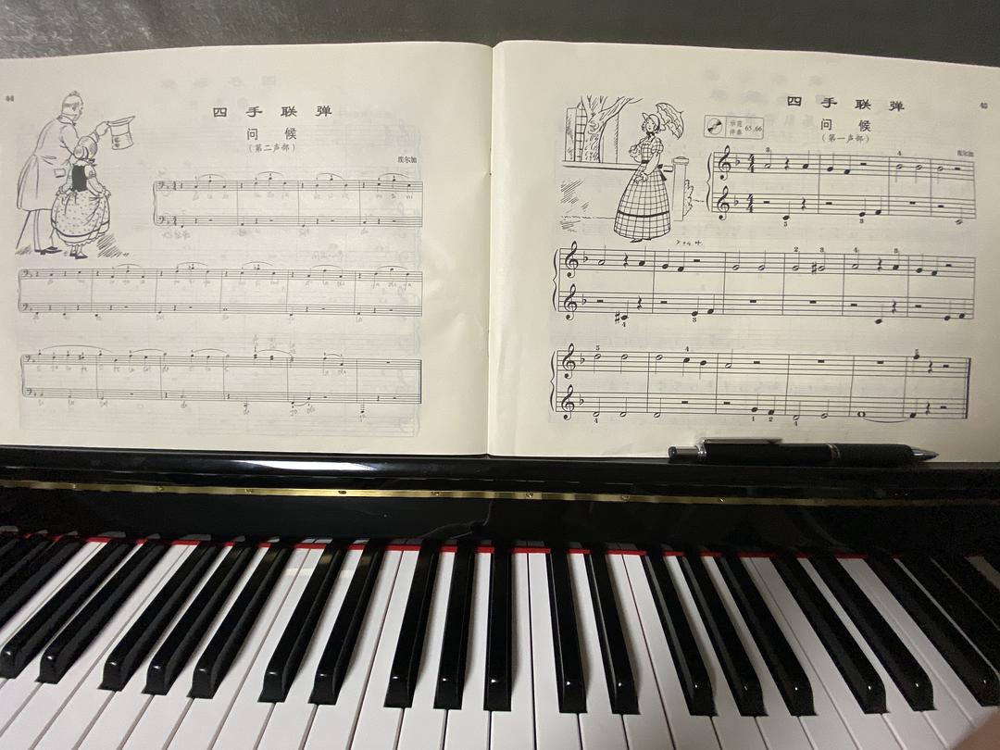
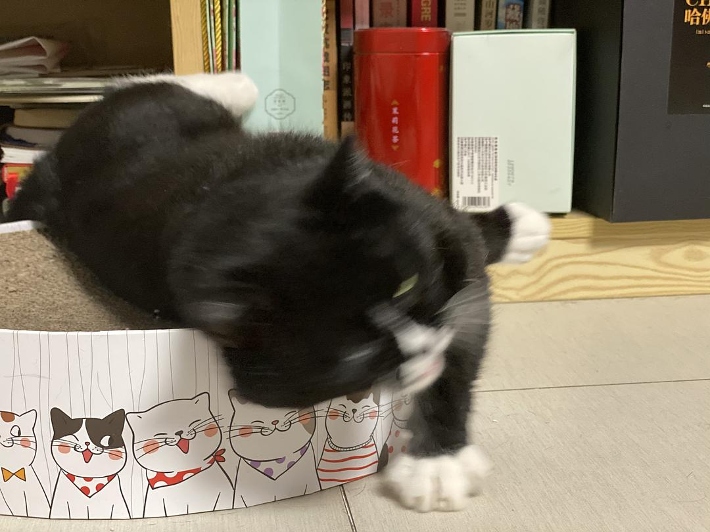

来源：[盘子（来自豆瓣）](https://www.douban.com/people/zhaoxun69/)的[广播](https://www.douban.com/people/zhaoxun69/status/2840611730/)

2020-02-29_22:03:48

“老师我的进度是小汤二第四课而已。”
“不要紧直接把十六课的《问候》也练一下，两个声部都练……”
“老师我第二声部这个低音谱号后面我真不认识我的天这下加四条线是哪个fa……”
“反正你要记熟的不管你怎么记，死记硬背也记熟，俩声部练熟以后不要管现有指法左边左手右边右手四手改俩手试试哈！”
我觉得对我信任度有点太高了，毕竟这两天忙起来了两天才有一小时练琴时间。图二是识谱识到崩溃左右手胡倒腾一气的我本人……😭
  

  

