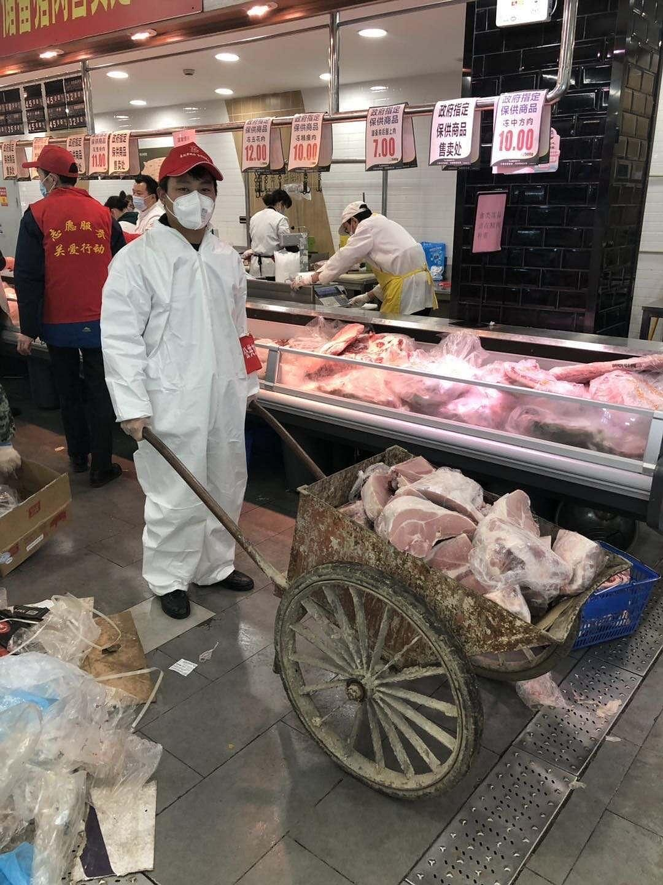
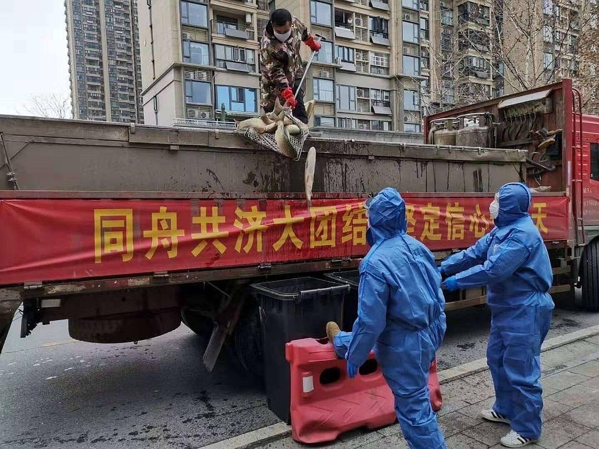

来源：[地味鸭（来自豆瓣）](https://www.douban.com/people/47513232/)的[广播](https://www.douban.com/people/47513232/status/2862511816/)

2020-03-12_08:52:12

以为只是运输过程使用多辆垃圾车、环卫车。没想到装配过程直接上建筑工地手推车和垃圾桶……突破想象力
  

  

