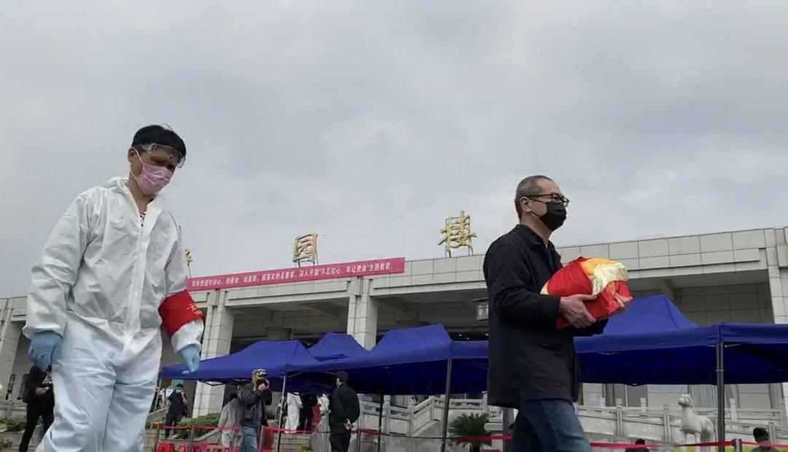
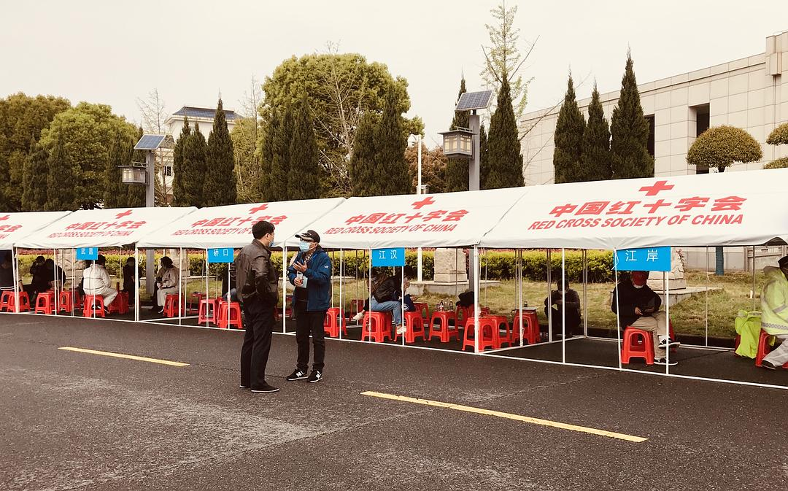

来源：[沙丘（来自豆瓣）](https://www.douban.com/people/54876686/)的[广播](https://www.douban.com/people/54876686/status/2885856044/)

2020-03-26_14:28:44

我是今天上午10点左右到汉口殡仪馆的，大门口沿路停着长长的私家车和志愿者车队，进门安保很严，到处是便衣，基本一抬手机就有人过来制止。我在里面待了两个小时，有的家属抱着遗照坐在对接点等待，有的抱着骨灰盒从我身边走过。人很多，很安静，没有哭声，也没有哀乐，他们就这样默默地抱着骨灰盒离开。只到最后我要离开才看到一位阿姨放声大哭，她的哭声引来所有人回头，大家呆呆地看着她，甚至有一丝尴尬。
  

  

  

