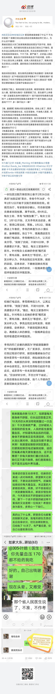

来源：[wstdq（来自豆瓣）](https://www.douban.com/people/wstdq/)的[广播](https://www.douban.com/people/wstdq/status/2896958767/)

2020-04-02_13:31:16

[cp]&#35;武汉日记&#35;&#35;封城日记&#35; 新冠患者是做错了什么？？不允许就医！？前期已经出现出院后在隔离酒店死亡的人，为什么还不重视！
真被武昌区大东门如家隔离酒店的医生气到不轻，我妈入住快10天，每天都在和医生反应自己呕吐口干胸闷，医生永远以血氧达标为由说正常，无法达到送医标准！！今天我妈妈浑身发抖，下不了床，更严重了，正好省人民的医生来查房，量血压才发现有高血压170的问题，说等一下会让医生再上来复查，结果人民的医生走了，隔离点医生还是没上去复查，逼的我自己给我妈妈买血压仪送隔离点！！！

我投诉到区里后，医生竟然还跟我打电话撒谎！说每天都在测血压！这TM是武昌区医学观察点？？？观察的莫B？观察到说了10天不舒服也没有送医！？也没人查血压？观察到还要家属自己买医疗设备送过去！？

结果到了晚上，我妈自量又血压高，难受到极致！根本无法入睡，强烈呕吐胸闷！在群里报了后，医生都不上来看一眼！还被医生各种冷嘲热讽？！！就不能好好和病患沟通吗？？上报身体异常在隔离点是有罪？？？是不准病人说话是吗？？？？？ 多一事不如少一事？

【哦，最重要】隔离点医生跟我回电，说他上报了，联系了我妈所在粮道街社区，社区答复他，不准病人就医，但社区和我说只有隔离点有权限安排就医。
我回告隔离点医生，社区的答复后，他又说他联系了武汉市第七医院（非新冠定点医院），【但现在接到的上级反馈是！武汉市不允许隔离点的新冠康复患者到医院就医！有基础病也不行！】
【有通话录音，但我不相信武汉市政府有这个规定！】
难道救治好后让基础病的年老者再等死嘛？？还是说只想拖到解除隔离就可以不管了...正常医院不收，我理解，可是还有10家新冠指定医院可以去呀？我不知道为什么联系非新冠定点的武汉市第七医院！
只是希望能就医检查，10天了，如果不是今天省人民医生来测了血压！至今都不会知道有血压高的问题！但我母亲患新冠前从来没有高血压，却患有心血管疾病，心脏时常不舒服，想就医确定是否是别的原因引起来的，怎么这么难！！
@六扇门之手 @赵晨_Morning @打奥特曼de小怪兽  @ic4fun @andy_bw @BIGWUGOD @DekVon @江宁婆婆 @今天也要好好吃饭l @卖萌的零食工 @午后狂睡 @浅笑1smile @阿朵阿莱 @安吉拉赫本 @我不是谦哥儿 @妹子说以后叫我七爷 https://douc.cc/3mA7Ya https://douc.cc/3mA7Ya https://douc.cc/3mA7Ya[/cp]
  

