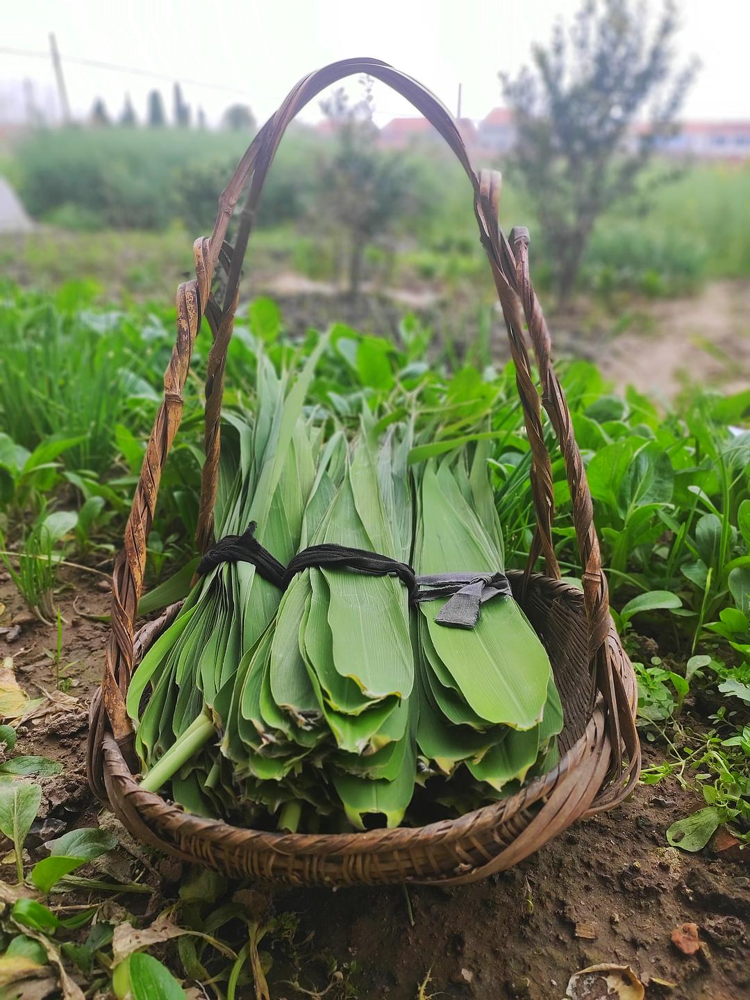

来源：[邓安庆（来自豆瓣）](https://www.douban.com/people/renjiananhuo/)的[广播](https://www.douban.com/people/renjiananhuo/status/2902342386/)

2020-04-05_17:12:58

粽子叶长得正好，母亲采了很多回来。我说：“这才清明节，你就准备端午节的事情了？”母亲说：“不管那个了，粽子我们想吃就吃。”
  

