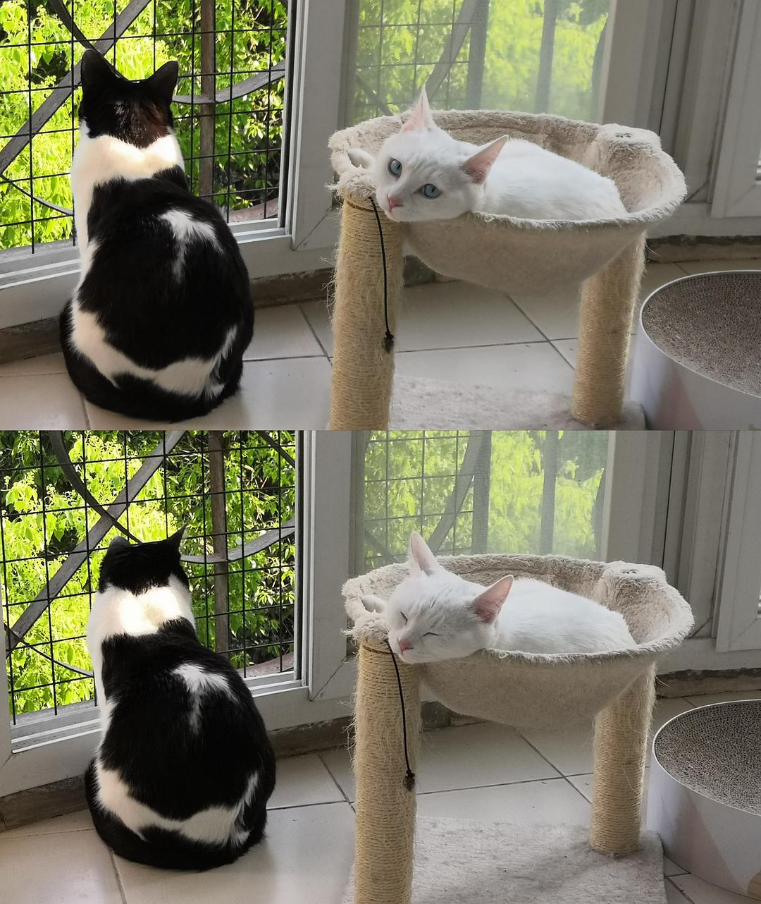

来源：[kaiba（来自豆瓣）](https://www.douban.com/people/137612465/)的[广播](https://www.douban.com/people/137612465/status/2908451187/)

2020-04-09_17:15:47

室友回武汉后几乎天天给我发两只崽的照片视频。扣子看起来还是老样子，两岁多的成年猫不发胖已经算好。
倒是小十一，我们走的时候不到五个月的小不点，回去后一下子就成了快八个月的成年猫。虽然还是瘦，但是骨架和脸完全张开了，室友说这感觉太神奇，错过了崽子的生长期，就好像完全换了一只猫在养。
这会儿两只崽在阳台上待着，一副岁月静好的亚子，在它们的记忆长河里，这三个月左右的日子会是忧郁的色彩吗？
外面世界发生了那么多事，他们每天蹲在阳台窗台的时候，会听到远处流浪猫狗被清理时的惨叫吗？
扣子在那边蹲着的背影看起来好孤独，它会想我吗？
嗯，应该不会吧，它一直只是在看树上的鸟。
  

